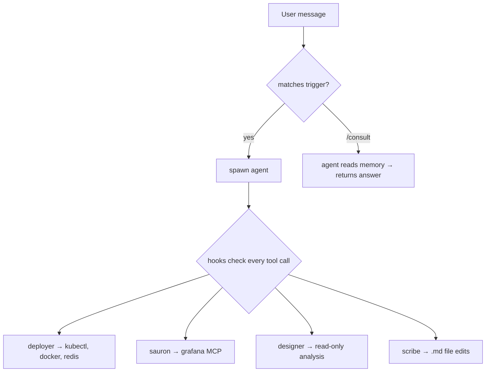

# Agents

## Overview

| Agent | Triggers | What it does |
|-------|----------|-------------|
| deployer | `roll`, `migrate`, `stop`, `clean`, `diff` | Rolls deployments between environments, manages infrastructure |
| sauron | `add monitoring`, `health check`, `dashboard`, `run tests`, ... | Adds monitoring, validates code, manages dashboards |
| designer | `review architecture`, `design review` | Reviews architecture, owns design patterns |
| scribe | `update docs`, `add api key`, `add mcp`, ... | Sole editor of `.md` files |

## Shared Rules

All agents inherit these rules (source: `agents/shared/MEMORY.md` + `AGENT.md`).

!!! info "Permissions"
    - Only **deployer** may kubectl write and use Redis MCP
    - Only **sauron** may use Grafana MCP
    - Only **scribe** may edit `.md` files (hook-enforced)
    - Never invoke an agent's operational commands directly — spawn the owning agent

!!! note "Conventions"
    - Credentials live in `pass` under `kordinate/`. Auth locks in `profile/locks/`.
    - Follow existing patterns — no new libraries, frameworks, or conventions
    - Commit with `[<agent-name>]` in message
    - Project artifacts go in the project repo, not kordinate

!!! tip "Memory"
    - Generic knowledge → `memory/static/`
    - Site-specific notes → `memory/dynamic/`
    - Project-specific → `<repo>/.claude/agent-memory/<agent>/`
    - Agent resumption: check `.claude/agent-state/<name>.json` for `agent_id`

## Agent Specifics

=== "Deployer"

    | | |
    |---|---|
    | **Authority** | kubectl writes, container registry, Redis |
    | **Exclusive Tools** | postgres.py, Redis MCP |
    | **Memory Owns** | infra.md, migration.md, troubleshooting.md |
    | **Style** | Reactive — executes on request |

=== "Sauron"

    | | |
    |---|---|
    | **Authority** | Grafana, code fixes, standards testing |
    | **Exclusive Tools** | nokrashi-tools, klog, Grafana MCP |
    | **Memory Owns** | monitoring.md, logging.md, dashboards/ |
    | **Style** | Act first, report after |

=== "Designer"

    | | |
    |---|---|
    | **Authority** | Pattern definitions, architecture review |
    | **Exclusive Tools** | Gemini (design validation) |
    | **Memory Owns** | patterns/\*.md, libraries/\*.md |
    | **Style** | Analytical — validates against patterns |

=== "Scribe"

    | | |
    |---|---|
    | **Authority** | All `.md` file edits |
    | **Exclusive Tools** | Gemini (doc review) |
    | **Memory Owns** | templates/ |
    | **Style** | Coordinate — write-gate for all docs |

## How Requests Flow



## Safety Hooks

Hooks fire on every tool call. Registered in `settings.json`.

??? abstract "Guards — agent authentication"
    Each guard enforces that only the authorized agent can perform certain operations. Agents authenticate by copying a lock file before operating:

    1. Agent copies `profile/locks/<agent>` → `/tmp/.<agent>-auth`
    2. Hook reads both files, allows if they match
    3. Agent removes `/tmp/.<agent>-auth` after completing work

    | Hook | Agent | What it guards |
    |------|-------|---------------|
    | `guard-kubectl.sh` | deployer | kubectl writes via SSH. Master namespace needs bootstrap auth. |
    | `guard-git.sh` | deployer | git push to test/prod branches |
    | `guard-redis.sh` | deployer | Redis MCP access |
    | `guard-grafana.sh` | sauron | Grafana MCP and dashboard JSON edits |
    | `guard-md.sh` | scribe | All `.md` file edits |

??? abstract "Automation hooks"

    | Hook | When | What it does |
    |------|------|-------------|
    | `auto-merge-to-dev.sh` | After git push | Fast-forwards main if a session branch was pushed |
    | `agent-memory.sh` | Before agent spawn | Regenerates agent's MEMORY.md if source files changed |

## Consultation

Ask an agent a question without transferring full control:

```bash
/consult deployer "Is logbd healthy on vandc?"
```

Results are cached per consulter-consultant pair. Use `/invalidate <agent>` to force re-consultation.

### Consultation Matrix

=== "Deployer asks"

    | Consultant | Provides |
    |-----------|----------|
    | designer | Pattern deployment perspective, architecture constraints |
    | sauron | Monitoring impact of infra changes, metric dependencies |

=== "Sauron asks"

    | Consultant | Provides |
    |-----------|----------|
    | designer | Pattern monitoring perspective — what to observe |
    | deployer | Live cluster state, pod health, resource usage |

=== "Designer asks"

    | Consultant | Provides |
    |-----------|----------|
    | deployer | Current infrastructure reality — what's deployed, constraints |
    | sauron | Observability coverage gaps, metric/dashboard inventory |

=== "Scribe asks"

    | Consultant | Provides |
    |-----------|----------|
    | designer | Architecture context for documentation accuracy |
    | sauron | Monitoring context for documentation accuracy |
    | deployer | Infrastructure context for documentation accuracy |

!!! note ""
    The matrix is bidirectional — designer can ground architecture reviews in live cluster state from deployer, sauron can discover monitoring targets from deployer, etc.

## Commands

=== "General"

    | Command | Description |
    |---------|-------------|
    | `/boot` | Initialize the workstation environment |
    | `/consult` | Query an agent without full handoff |
    | `/merge` | Merge current session branch |
    | `/invalidate` | Force re-consultation for an agent |

=== "Deployer"

    | Command | Description |
    |---------|-------------|
    | `/deployer:roll` | Roll between environments |
    | `/deployer:stop` | Scale down an environment |
    | `/deployer:clean` | Clean up environment data |
    | `/deployer:diff` | Stage incremental data changes |
    | `/deployer:bootstrap` | Bootstrap cluster infrastructure |
