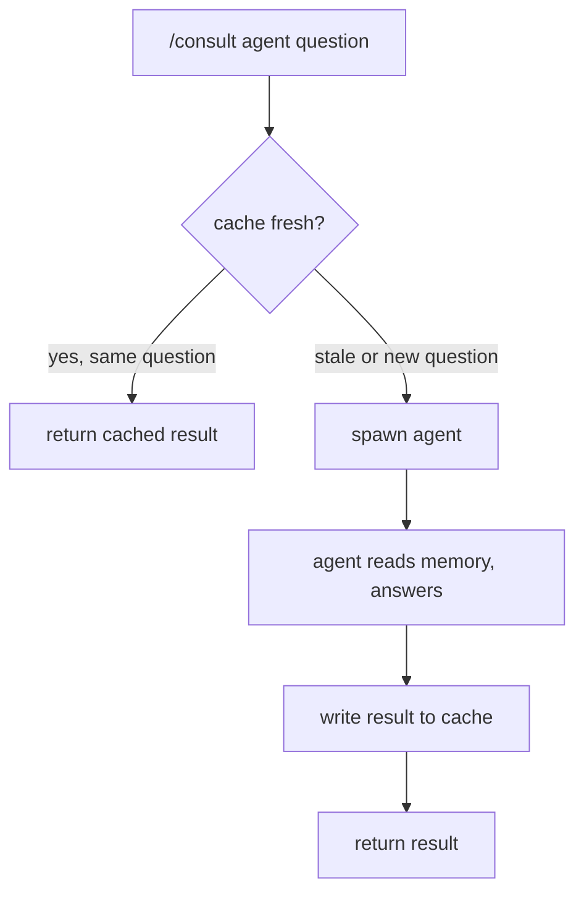

# Consultation

Ask an agent a question without transferring full control.

## Usage

```bash
/consult deployer "Is logbd healthy on vandc?"
/consult sauron "what metrics does the enricher expose?"
/consult designer "what are logbd's main components?"
```

## How It Works



Results are cached per consulter-consultant pair at `agents/shared/memory/dynamic/`. The cache uses the framework's [hash-based invalidation](memory.md#cache-system) — if the consultant's source files change, the cache goes stale automatically.

!!! tip "Force re-consultation"
    ```bash
    /invalidate deployer
    ```
    Removes hash files where the given agent is the consultant. Cache content is preserved as fallback — refreshed on next `/consult`.

## Consultation Matrix

=== "Deployer asks"

    | Consultant | Provides |
    |-----------|----------|
    | designer | Pattern deployment perspective, architecture constraints |
    | sauron | Monitoring impact of infra changes, metric dependencies |

=== "Sauron asks"

    | Consultant | Provides |
    |-----------|----------|
    | designer | Pattern monitoring perspective — what to observe |
    | deployer | Live cluster state, pod health, resource usage |

=== "Designer asks"

    | Consultant | Provides |
    |-----------|----------|
    | deployer | Current infrastructure reality — what's deployed, constraints |
    | sauron | Observability coverage gaps, metric/dashboard inventory |

=== "Scribe asks"

    | Consultant | Provides |
    |-----------|----------|
    | designer | Architecture context for documentation accuracy |
    | sauron | Monitoring context for documentation accuracy |
    | deployer | Infrastructure context for documentation accuracy |

!!! note ""
    The matrix is bidirectional — designer can ground architecture reviews in live cluster state from deployer, sauron can discover monitoring targets from deployer, etc.

## Cache Invalidation

Each consultant declares its **cache source directories** in the `## Cache Sources` section of its `instructions/consultation.md`. These are the directories whose content determines whether a cached consultation answer is still valid.

A PostToolUse hook automatically invalidates cached answers when the consultant's source files change. The hook hashes the declared source directories after each tool use — if the hash differs from the stored hash, the cache entry is marked stale and the next `/consult` call will re-invoke the agent instead of returning the cached answer.

| Agent | Cache Sources |
|-------|---------------|
| deployer | `instructions/`, `memory/`, `manifests/`, `profile/config.yaml` |
| sauron | `instructions/`, `memory/` |
| designer | `instructions/`, `memory/` |
| scribe | `instructions/`, `memory/static/` |

!!! tip "Manual invalidation"
    Use `/invalidate <agent>` to force-clear a specific agent's cached answers without waiting for source changes.
