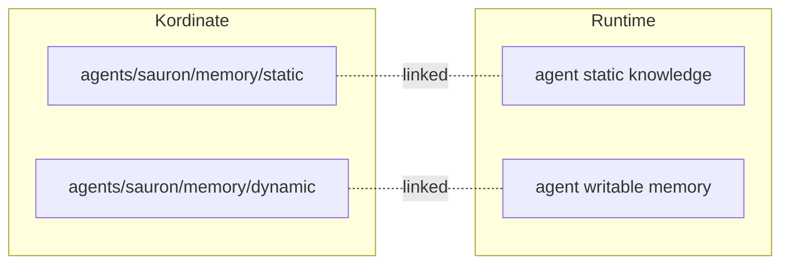

# Linking

The linking layer maps kordinate's file structure to what the agent runtime expects. Kordinate is runtime-agnostic — the linking layer is the only part that changes when switching runtimes.

## What Gets Linked

| Kordinate | Purpose |
|-----------|---------|
| `IDENTITY.md` | Agent identity — mapped to runtime's agent config |
| `memory/static/` | Curated knowledge — made accessible to the agent |
| `memory/dynamic/` | Auto-managed state — writable by the agent |
| `commands/` | Slash command definitions |
| `hooks/` | Guard and automation scripts |

The linking layer creates symlinks and copies as needed to make these available at the paths the runtime expects.

## Memory Mapping

The linking layer maps kordinate's [Recall System](../framework/memory.md) into the runtime:



## Claude Code

The current linking implementation targets Claude Code. Run `installer/link-claude.sh` to apply.

In a pre-built container image, the Dockerfile runs the link script at build time:

```dockerfile
COPY kordinate/ /opt/kordinate/
RUN /opt/kordinate/installer/link-claude.sh
```

### Identity

| Claude Code | Kordinate |
|-------------|-----------|
| `CLAUDE.md` | `agents/root/IDENTITY.md` |
| `agents/<agent>/CLAUDE.md` | `agents/<agent>/IDENTITY.md` |

### Symlinks

| At `~/.claude/` | Kordinate |
|------------------|-----------|
| `agents/` | `agents/` |
| `commands/` | `commands/` |
| `hooks/` | `hooks/` |
| `profile/` | `profile/` |
| `settings.json` | `settings.json` |
| `keybindings.json` | `profile/keybindings.json` |
| `.mcp.json` | `profile/mcp.json` |
| `agent-memory/<agent>/` | `agents/<agent>/memory/dynamic/` |

### Adding a Runtime

To support a new runtime (Codex, Cursor, etc.), create a new link script that maps kordinate's structure to that runtime's expected paths. The framework files stay the same — only the linking changes.
