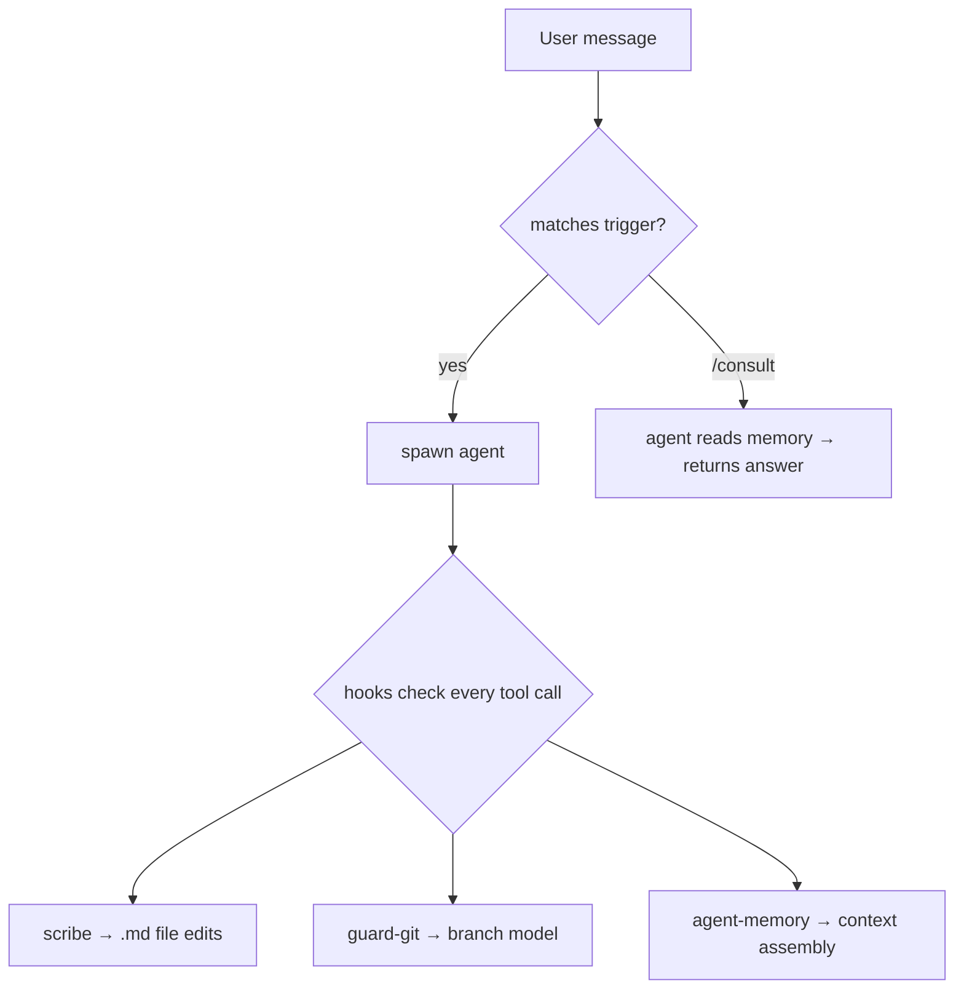

# Core Agents

## Base Agent

Every agent inherits these rules, commands, and hooks.

### Rules

!!! info "Permissions"
    - Only the owning agent can use its exclusive tools (hook-enforced)
    - Never invoke an agent's operational commands directly — spawn the owning agent

!!! note "Conventions"
    - Credentials live in `pass` under `kordinate/`
    - Follow existing patterns — no new libraries, frameworks, or conventions
    - Commit with `[<agent-name>]` in message
    - Project artifacts go in the project repo, not kordinate

!!! tip "Memory"
    Each agent has `static/` (pre-defined structure) + `dynamic/` (free-form) at both global and project scope. See [Memory](memory.md).

### Commands

| Command | Description |
|---------|-------------|
| `/boot` | Initialize the workstation environment |
| `/consult` | Query an agent without full handoff |
| `/merge` | Merge current session branch |
| `/invalidate` | Force re-consultation for an agent |

### Hooks

Hooks fire on every tool call. They enforce safety and automate housekeeping.

**Guards** — each guard enforces that only the authorized agent can perform certain operations.

| Hook | What it guards |
|------|---------------|
| `guard-git.sh` | git push — `main` and `session/*` allowed, `test`/`prod` require auth |
| `guard-md.sh` | All `.md` file edits (scribe only) |

??? abstract "Authentication flow"
    1. Agent copies `profile/locks/<agent>` → `/tmp/.<agent>-auth`
    2. Hook reads both files, allows if they match
    3. Agent removes `/tmp/.<agent>-auth` after completing work

**Automation**

| Hook | When | What it does |
|------|------|-------------|
| `auto-merge-to-dev.sh` | After git push | Creates PR, tries fast-forward main. On failure, signals `/merge`. |
| `agent-memory.sh` | Before agent spawn | Regenerates agent's MEMORY.md if source files changed |

Cache system: both hooks use `lib/cache.sh` for hash-based invalidation. See [Memory — Cache System](memory.md#cache-system).

## Scribe

The only framework-provided agent — present in every team. Manages all `.md` file edits so documentation stays consistent and protected.

Triggered by: `update docs`, `update project docs`, `add api key`, `add mcp`, `update agent docs`, `write readme`

| Command | Description |
|---------|-------------|
| `/scribe:add-mcp` | Add a new MCP server entry |
| `/scribe:update-agent-docs` | Update an agent's documentation |
| `/scribe:update-project-docs` | Update project-level docs |
| `/scribe:update-subagent-memory` | Update agent memory files |
