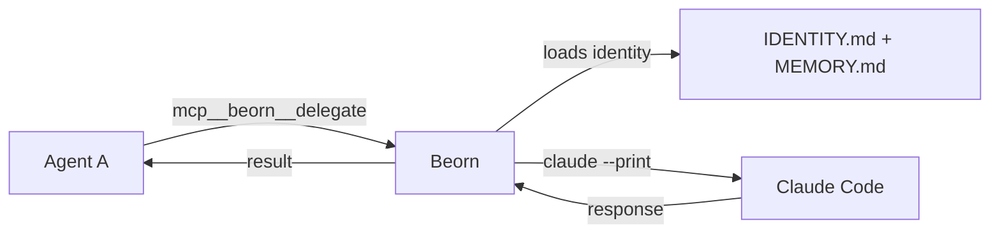

# Beorn

A shape-shifting MCP agent server. Beorn is a single always-on service that can become any agent on demand — it loads the target agent's identity and memory, invokes Claude Code as that agent, and returns the response.



## Why

Claude Code subagents can't spawn their own sub-subagents. Beorn solves this by providing inter-agent communication as an MCP tool — any agent at any depth can call another agent without nesting.

## Tools

| Tool | Input | Description |
|------|-------|-------------|
| `mcp__beorn__delegate` | `{ agent, prompt }` | Invoke an agent identity and return its response |
| `mcp__beorn__status` | `{}` | Server uptime, known agents, active requests |

??? example "Deployer consulting designer via beorn"

    ```
    mcp__beorn__delegate({
      agent: "designer",
      prompt: "Should beorn use Recreate or RollingUpdate strategy?"
    })
    ```

    Beorn loads the designer's IDENTITY.md and MEMORY.md, runs `claude --print --system-prompt <designer identity> <prompt>`, and returns the designer's response.

## How It Works

1. **Request arrives** — an agent calls `mcp__beorn__delegate` with a target agent name and prompt
2. **Memory regeneration** — beorn runs `agent-memory.sh` to ensure the target's MEMORY.md is current (hash-cached, fast if unchanged)
3. **Identity loading** — reads the target's `IDENTITY.md` (stripped of frontmatter) and `MEMORY.md`
4. **Invocation** — spawns `claude --print --system-prompt <identity+memory> <prompt>`
5. **Cleanup** — resets git state (`git checkout . && git clean -fd`) to prevent side-effect bleed between agents
6. **Response** — returns the agent's response to the caller

Each invocation is independent. Concurrent requests are supported — each spawns its own Claude process.

## Architecture

Beorn runs as a Node.js Express server with the MCP SDK (`@modelcontextprotocol/sdk`). It exposes a stateless HTTP MCP endpoint at `/mcp` and a health endpoint at `/health`.

```
kordinate/lib/mcp-agent-server/
├── server.js        # Express + MCP server, tool handlers, agent invocation
├── package.json     # express, @modelcontextprotocol/sdk, zod
└── .gitignore       # node_modules/
```

**K8s deployment** (in-cluster):

```
kordinate/agents/deployer/manifests/gateway/base/
├── beorn.yaml                  # Deployment + Service + PVC (replicas: 1)
└── beorn/entrypoint.sh         # Boot: git pull, link-claude, npm install, start server
```

Service DNS: `agent-pool.gateway.svc.cluster.local:3100`

**Local** (workstation): `link-claude.sh` installs deps, registers the MCP server, and starts beorn automatically.

## Registry

Beorn reads available agents from `agents/registry.yaml`:

```yaml
agents:
  deployer:
    description: GitOps deployments, cluster state
  sauron:
    description: Monitoring, metrics, health checks
  designer:
    description: Architecture review, pattern authority
  scribe:
    description: Documentation, sole .md editor
```

Adding a new agent to the registry makes it available via `mcp__beorn__delegate`.

---

??? note "Related"

    | Resource | Purpose |
    |----------|---------|
    | [Kords](kords.md) | Cached consultation protocol (uses beorn for transport) |
    | [Guards](guards.md) | Auth enforcement (runs inside each agent invocation) |
    | [Recall System](memory.md) | Memory that beorn loads for each agent |
