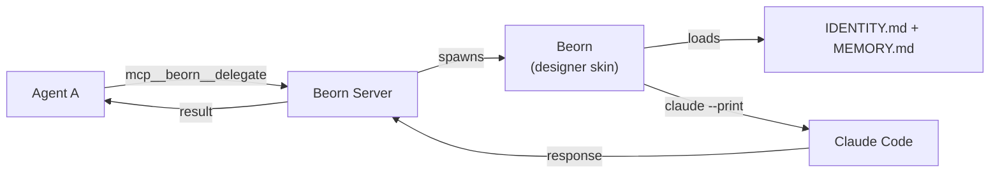

# Subagent P2P

Current agent runtimes don't allow subagents to spawn other subagents. Kordinate removes this limitation by introducing **beorn** — a short-lived agent clone spawned on demand. It assumes a **skin** — the target agent's identity and memory — handles a single request, and exits. The **beorn server** is the MCP factory that manages this lifecycle.



## Why

Without P2P, a deployer agent can't ask a designer agent for a review — only root can spawn agents. The beorn server provides agent invocation as an MCP tool, so any agent at any depth can spawn a beorn with another agent's skin.

## Tools

| Tool | Input | Description |
|------|-------|-------------|
| `mcp__beorn__delegate` | `{ agent, prompt }` | Spawn a beorn with the target agent's skin |
| `mcp__beorn__status` | `{}` | Server uptime, known agents, active requests |

??? example "Deployer consulting designer"

    ```
    mcp__beorn__delegate({
      agent: "designer",
      prompt: "Should beorn use Recreate or RollingUpdate strategy?"
    })
    ```

    The beorn server spawns a beorn with the designer skin — loads the designer's IDENTITY.md and MEMORY.md, runs `claude --print`, and returns the response.

## How It Works

1. **Request arrives** — an agent calls `mcp__beorn__delegate` with a target agent name and prompt
2. **Memory regeneration** — the beorn server runs `agent-memory.sh` to ensure the target's MEMORY.md is current (hash-cached, fast if unchanged)
3. **Identity loading** — reads the target's `IDENTITY.md` (stripped of frontmatter) and `MEMORY.md` — this is the **skin**
4. **Beorn spawned** — a new `claude --print` process runs with the skin as its system prompt
5. **Cleanup** — resets git state to prevent side-effect bleed between skins
6. **Response** — the beorn server returns the response to the caller

Each beorn is independent. Concurrent requests spawn separate beorns — each with its own Claude process.

## Architecture

The beorn server runs as a Node.js Express server with the MCP SDK (`@modelcontextprotocol/sdk`). It exposes a stateless HTTP MCP endpoint at `/mcp` and a health endpoint at `/health`.

```
kordinate/lib/mcp-agent-server/
├── server.js        # Express + MCP server, tool handlers, agent invocation
├── package.json     # express, @modelcontextprotocol/sdk, zod
└── .gitignore       # node_modules/
```

**K8s deployment** (in-cluster):

```
kordinate/agents/deployer/manifests/gateway/base/
├── beorn.yaml                  # Deployment + Service + PVC (replicas: 1)
└── beorn/entrypoint.sh         # Boot: git pull, link-claude, npm install, start server
```

Service DNS: `agent-pool.gateway.svc.cluster.local:3100`

**Local** (workstation): `link-claude.sh` installs deps, registers the MCP server, and starts the beorn server automatically.

## Registry

The beorn server reads available skins from `agents/registry.yaml`:

```yaml
agents:
  deployer:
    description: GitOps deployments, cluster state
  sauron:
    description: Monitoring, metrics, health checks
  designer:
    description: Architecture review, pattern authority
  scribe:
    description: Documentation, sole .md editor
```

Adding a new agent to the registry makes its skin available via `mcp__beorn__delegate`.

---

??? note "Related"

    | Resource | Purpose |
    |----------|---------|
    | [Kords](kords.md) | Cached consultation protocol (uses the beorn server for transport) |
    | [Guards](guards.md) | Auth enforcement (runs inside each beorn invocation) |
    | [Recall System](memory.md) | Memory loaded as part of each skin |
