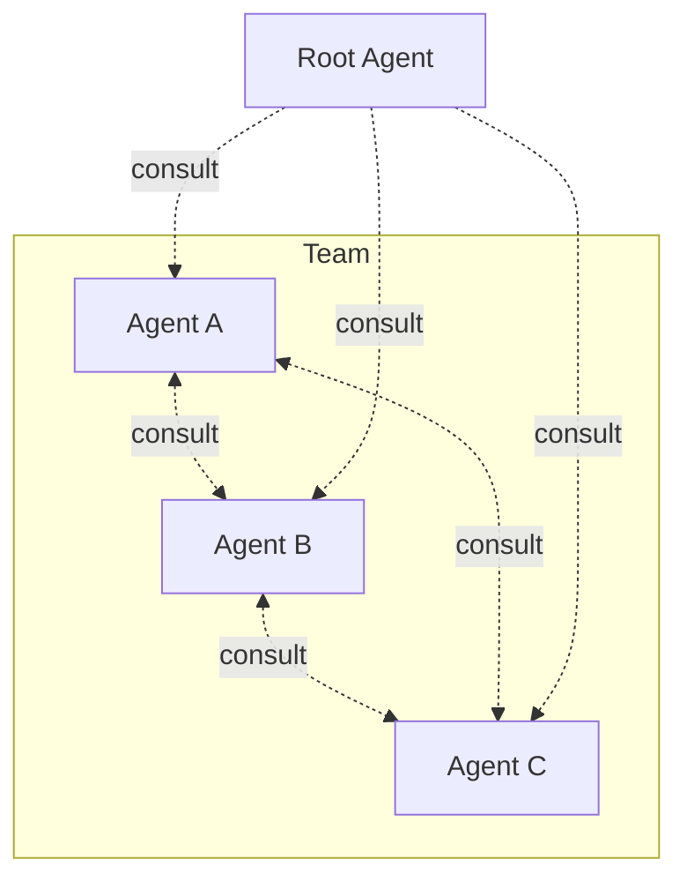
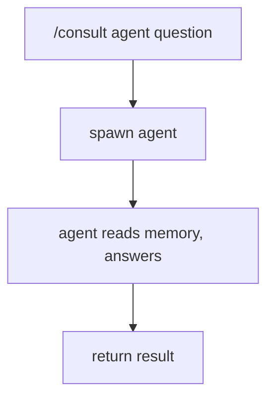

# Architecture Overview



The [root agent](root.md) routes user requests to the right agent. Agents consult each other for expertise they lack. Each agent has exclusive tools enforced by [hooks](root.md#hooks-inherited-by-all), and stores knowledge in [2D memory](memory.md).

## Consultation

Agents ask each other questions without transferring full control. The root agent spawns a consultant, the consultant reads its memory and answers.

```bash
/consult <agent> "<question>"
```



Results are cached — see [Cache](memory.md#cache) for how freshness is managed. `/invalidate <agent>` forces re-consultation.

## Consultation Matrix

The root agent owns the consultation matrix — it defines which agents can consult which, and what expertise each provides. The matrix lives in root's `KORD.md`.

Each row declares: "when I need X, I consult Y." The matrix is bidirectional — agents can consult each other in both directions.

??? abstract "Example: infra team matrix"

    === "Deployer asks"

        | Consultant | Provides |
        |-----------|----------|
        | designer | Pattern deployment perspective, architecture constraints |
        | sauron | Monitoring impact of infra changes, metric dependencies |

    === "Sauron asks"

        | Consultant | Provides |
        |-----------|----------|
        | designer | Pattern monitoring perspective — what to observe |
        | deployer | Live cluster state, pod health, resource usage |

    === "Designer asks"

        | Consultant | Provides |
        |-----------|----------|
        | deployer | Infrastructure reality — live cluster state, resource usage |
        | sauron | Observability gaps — what is and isn't being monitored |

    === "Scribe asks"

        | Consultant | Provides |
        |-----------|----------|
        | designer | Architecture context — component topology, design patterns |
        | sauron | Monitoring context — metrics, dashboards, health checks |
        | deployer | Infrastructure context — cluster state, deployment details |
