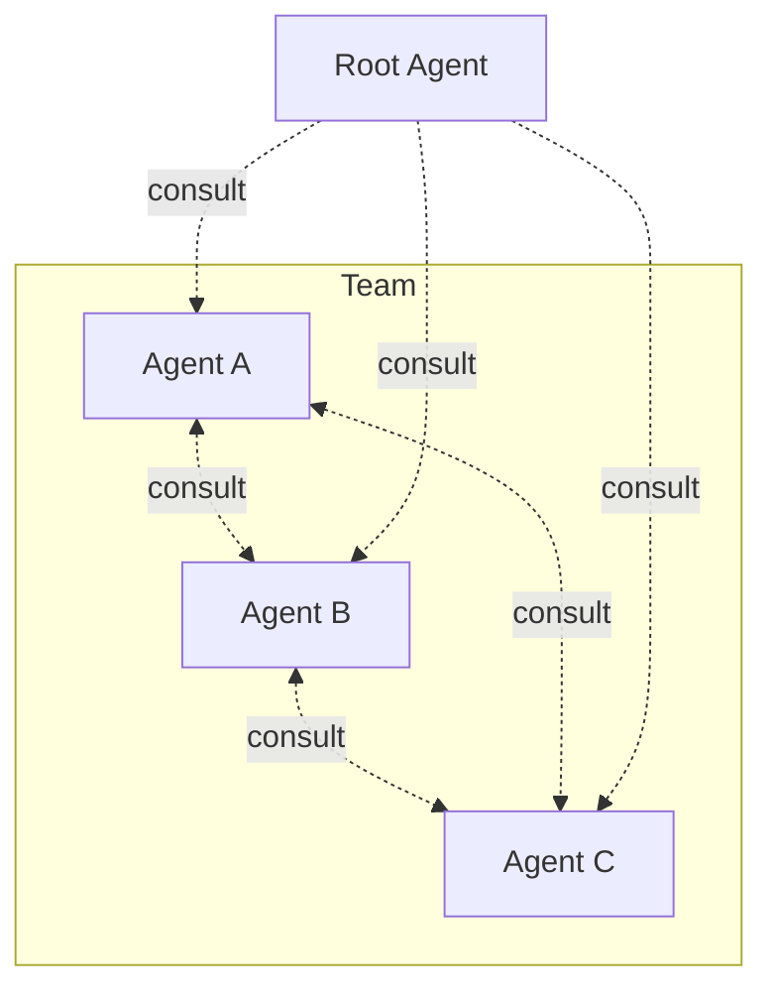

# Architecture Overview



The root agent is the user's existing agent (Claude, Codex, Cursor). The [linking layer](../reference/linking.md) enhances it with kordinate's coordination capabilities:

- **[Memory](memory.md)** — structured knowledge (static/dynamic × global/project) with caching and refresh
- **[Hooks](#role-enforcement)** — enforce that only the right agent performs protected operations
- **Routing** — trigger words automatically spawn the right specialist
- **[Consultation](#consultation)** — agents query each other for expertise they lack

## Agent Structure

Every agent follows the same layout. `KORD.md` defines identity, `memory/` holds knowledge.

### KORD.md

| Section | What it contains |
|---------|-----------------|
| **Description** | One-line role definition |
| **Commands** | Slash commands the agent owns |
| **Rules** | Behavioral constraints |
| **Consultation** | What it answers when consulted |
| **Cache Sources** | What files define this agent's knowledge freshness |

### Directory skeleton

```
agents/<agent>/
├── KORD.md                        # identity + cache sources
├── memory/
│   ├── static/
│   │   ├── instructions/          # procedures (consultation, workflow, auth)
│   │   └── ...                    # domain knowledge
│   └── dynamic/                   # auto-managed (operational notes, caches)
└── commands/                      # slash command definitions
```

## Role Enforcement

Protected operations are restricted to specific agents via guard hooks. Each guard uses a lock-file handshake:

1. Agent copies `profile/locks/<agent>` → `/tmp/.<agent>-auth`
2. Hook reads both files, allows if they match
3. Agent removes `/tmp/.<agent>-auth` after completing work

Only the owning agent can perform its exclusive operations — even if another agent attempts to, the hook blocks it.

## Consultation

```
/consult <agent> "<question>"
```

An agent answers using its memory without taking over the conversation. Results are [cached](memory.md#cache) — `/invalidate <agent>` forces a fresh answer.

### Consultation Matrix

Owned by [root](root.md) — defines who consults whom and for what. Lives in root's `KORD.md`.

??? abstract "Example: infra team"

    === "Deployer asks"

        | Consultant | Provides |
        |-----------|----------|
        | designer | Pattern deployment perspective, architecture constraints |
        | sauron | Monitoring impact of infra changes, metric dependencies |

    === "Sauron asks"

        | Consultant | Provides |
        |-----------|----------|
        | designer | Pattern monitoring perspective — what to observe |
        | deployer | Live cluster state, pod health, resource usage |

    === "Designer asks"

        | Consultant | Provides |
        |-----------|----------|
        | deployer | Infrastructure reality — live cluster state, resource usage |
        | sauron | Observability gaps — what is and isn't being monitored |

    === "Scribe asks"

        | Consultant | Provides |
        |-----------|----------|
        | designer | Architecture context — component topology, design patterns |
        | sauron | Monitoring context — metrics, dashboards, health checks |
        | deployer | Infrastructure context — cluster state, deployment details |
