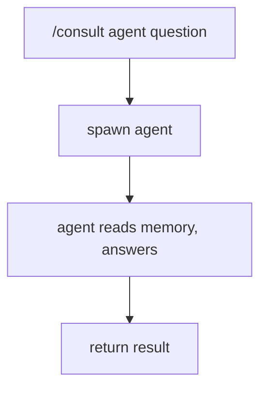

# Consultation

Ask an agent a question without transferring full control.

## Usage

```bash
/consult deployer "Is logbd healthy on vandc?"
/consult sauron "what metrics does the enricher expose?"
/consult designer "what are logbd's main components?"
```

## How It Works



Results are cached — see [Cache](memory.md#cache) for how freshness is managed.

!!! tip "Force re-consultation"
    `/invalidate <agent>` clears all cached answers from that agent.

## Consultation Matrix

Which agents consult which, and what each provides. The matrix is bidirectional — designer can ground architecture reviews in live cluster state from deployer, sauron can discover monitoring targets from deployer, etc.

=== "Deployer asks"

    | Consultant | Provides |
    |-----------|----------|
    | designer | Pattern deployment perspective, architecture constraints |
    | sauron | Monitoring impact of infra changes, metric dependencies |

=== "Sauron asks"

    | Consultant | Provides |
    |-----------|----------|
    | designer | Pattern monitoring perspective — what to observe |
    | deployer | Live cluster state, pod health, resource usage |

=== "Designer asks"

    | Consultant | Provides |
    |-----------|----------|
    | deployer | Infrastructure reality — live cluster state, resource usage, deployment topology |
    | sauron | Observability gaps — what is and isn't being monitored |

=== "Scribe asks"

    | Consultant | Provides |
    |-----------|----------|
    | designer | Architecture context — component topology, design patterns |
    | sauron | Monitoring context — metrics, dashboards, health checks |
    | deployer | Infrastructure context — cluster state, deployment details |
