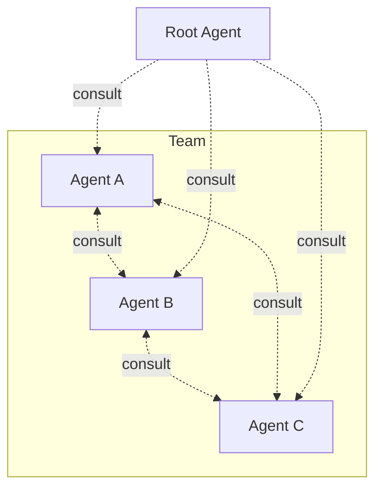

# Architecture Overview



[Root](root.md) routes requests. Agents consult each other. [Hooks](root.md) enforce boundaries. Knowledge lives in [2D memory](memory.md).

## Consultation

```
/consult <agent> "<question>"
```

An agent answers using its memory without taking over the conversation. Results are [cached](memory.md#cache) — `/invalidate <agent>` forces a fresh answer.

## Consultation Matrix

Owned by [root](root.md) — defines who consults whom and for what. Lives in root's `KORD.md`.

??? abstract "Example: infra team"

    === "Deployer asks"

        | Consultant | Provides |
        |-----------|----------|
        | designer | Pattern deployment perspective, architecture constraints |
        | sauron | Monitoring impact of infra changes, metric dependencies |

    === "Sauron asks"

        | Consultant | Provides |
        |-----------|----------|
        | designer | Pattern monitoring perspective — what to observe |
        | deployer | Live cluster state, pod health, resource usage |

    === "Designer asks"

        | Consultant | Provides |
        |-----------|----------|
        | deployer | Infrastructure reality — live cluster state, resource usage |
        | sauron | Observability gaps — what is and isn't being monitored |

    === "Scribe asks"

        | Consultant | Provides |
        |-----------|----------|
        | designer | Architecture context — component topology, design patterns |
        | sauron | Monitoring context — metrics, dashboards, health checks |
        | deployer | Infrastructure context — cluster state, deployment details |
