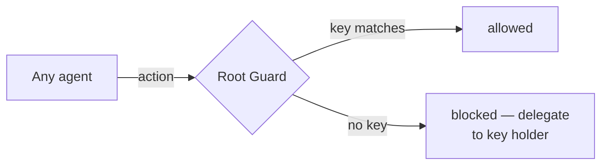

# Guards

Guards are a hook enhancement — they restrict specific operations to the agent that owns them. Built on the runtime's hook system, a guard checks for an auth token before allowing the action through.

1. Root defines the trigger — when the guard fires
2. The authorized agent writes its secret key before acting
3. The guard checks the key — passes or blocks

## Core guards

**Documentation guard** — `.md` edits must go through [scribe](agents.md#scribe). Any other agent is blocked and told to delegate.

**Cache refresh guard** — only the cache owner can refresh its own cache.

Teams can add their own (e.g., kubectl writes → deployer agent, Grafana MCP calls → sauron agent).
