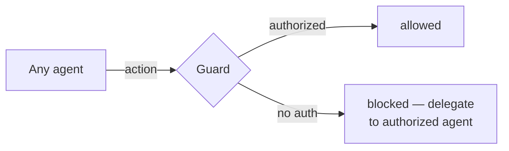

# Guards

Guards restrict operations to the agent that owns them. Built on the runtime's hook system — a guard checks for an auth token before allowing the action through.



1. The team defines the trigger — when the guard fires
2. The authorized agent writes its auth token before acting
3. The guard checks the token — passes or blocks

## Structured File Guard

[Structured files](memory.md) can only be written by scribe. The guard checks file properties in KORD.json to decide what to protect.

**How it works:**

1. Agent attempts to write a file
2. Guard matches the file path against registered structured patterns (`*/IDENTITY.md`, `*/skills/*/SKILL.md`, `kord/*/contract.md`, etc.)
3. Match → check for scribe auth token → block or allow
4. No match → allow (unstructured, any agent can write)

**Drift detection:** if a file has `structured: true` in frontmatter but doesn't match a registered pattern, the guard blocks it. Structured patterns are extended via scribe.

## Team Guards

Teams can define additional guards for tool ownership:

| Guard | Protects | Authorized Agent |
|-------|----------|-----------------|
| Structured files | `.md` writes matching registered patterns | scribe |
| kubectl writes | Cluster write operations | deployer |
| Grafana MCP | Dashboard management | sauron |

Each guard follows the same pattern: auth token check before the operation. The authorized agent copies its lock file before acting, removes it after.

## Adding Guards

Define in the team's hook configuration. The guard script reads the auth token and decides:

```bash
# Check if the authorized agent's token exists
if [ -f "/tmp/.<agent>-auth" ]; then
  echo '{}'  # allow
  exit 0
fi
echo '{"decision":"block","reason":"only <agent> may perform this operation"}'
```

Register in `settings.json` under the appropriate hook trigger (PreToolUse for most guards).
