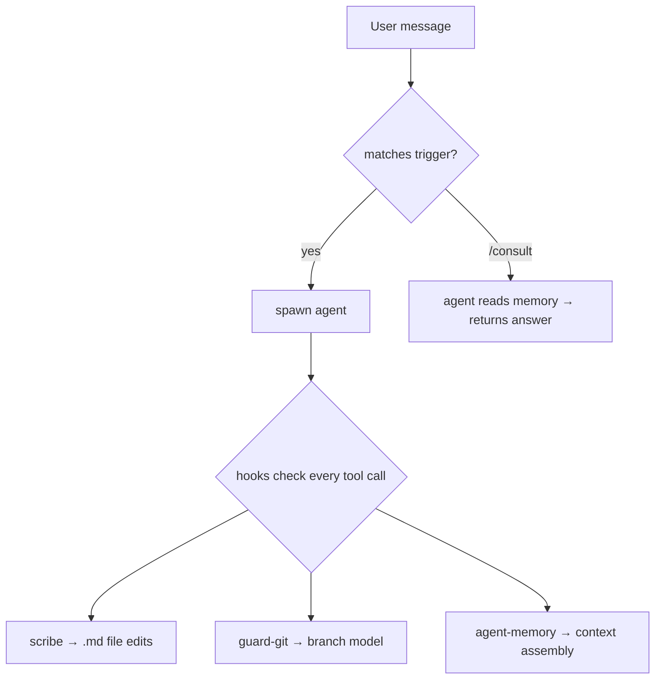

# Hooks

Hooks fire on every tool call. They enforce safety and automate housekeeping. Registered in `settings.json`.

## How Requests Flow

## Guards

Each guard enforces that only the authorized agent can perform certain operations.

### Authentication flow

1. Agent copies `profile/locks/<agent>` → `/tmp/.<agent>-auth`
2. Hook reads both files, allows if they match
3. Agent removes `/tmp/.<agent>-auth` after completing work

### Guard table

| Hook | Agent | What it guards |
|------|-------|---------------|
| `guard-git.sh` | deployer | git push — `main` and `session/*` allowed from anywhere, `test`/`prod` require deployer auth |
| `guard-md.sh` | scribe | All `.md` file edits (except agent memory dirs) |

## Automation

| Hook | When | What it does |
|------|------|-------------|
| `auto-merge-to-dev.sh` | After git push | Creates a PR for the session branch (if none exists), then tries to fast-forward main. On success, closes the PR. On failure, signals to run `/merge`. |
| `agent-memory.sh` | Before agent spawn | Regenerates agent's MEMORY.md if source files changed |

## Cache Library

Both hooks use the shared `lib/cache.sh` library for hash-based invalidation — hashing source files and skipping regeneration if unchanged. The cache system is also used by consultation and doc audit. See [Memory — Cache System](memory.md#cache-system) for full documentation.
