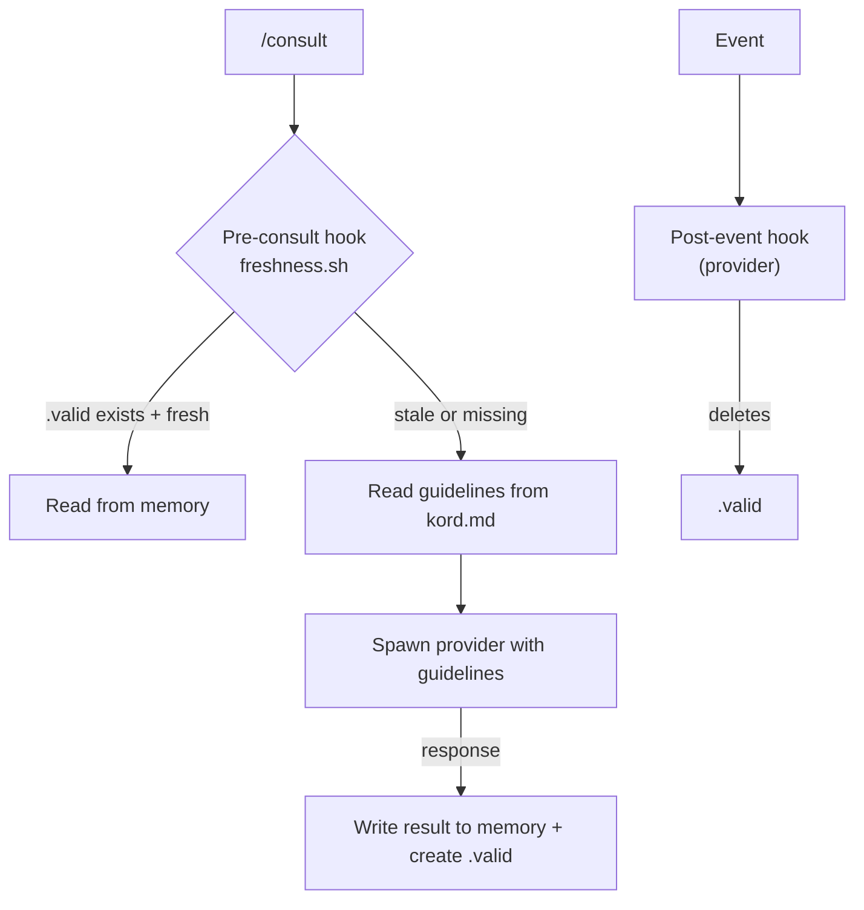
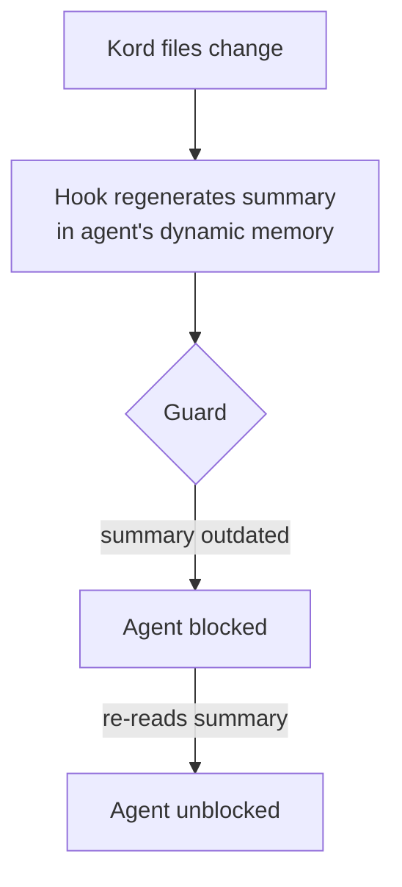

# Kords

A **kord** is a single consultation link between two agents — a template that defines one specific thing one agent provides to another. Two agents can be linked by multiple kords. A default kord exists for free-form queries.

| Concept | What it is | Where it lives | Nature |
|---------|-----------|----------------|--------|
| **Kord** | Template/protocol | `agents/root/kords/<name>/kord.md` | Static, root-owned |
| **Consultation** | Actual knowledge | `agents/<requester>/memory/dynamic/consultations/<result>.md` | Dynamic, requester-owned |

The kord is the template (like a class). The consultation is the actual knowledge (like an instance).

### Example

A deployer agent is about to change a Kubernetes manifest. Before applying, it needs a design review. Instead of asking root to relay the question, the deployer runs:

```
/consult pattern-review "review the beorn deployment manifest for pattern violations"
```

Behind the scenes:

1. `/consult` resolves `pattern-review` → finds `kord.md` (requester: deployer, provider: designer)
2. Checks the `.valid` marker — stale, so it proceeds
3. Reads the guidelines: *"Check against the pattern library. Report violations by severity."*
4. Spawns a beorn with the designer's skin, passes the question + guidelines
5. Caches the designer's response in `deployer/memory/dynamic/consultations/pattern-review.md`
6. Creates `.valid` — next time the deployer asks the same question, the cached answer is returned instantly

The deployer didn't need to know how to reach the designer. The kord defined the protocol. Beorn handled the transport. The cache avoids redundant calls.

## Structure

Root owns all kord definitions. Each kord is a directory containing the definition and a freshness script. A registry file lists all agents with brief descriptions.

**Naming:** kord directories are named by topic. Default kords: `default-<provider>/`

```
agents/root/kords/
├── registry.md
├── pattern-review/
│   ├── kord.md                              # template definition
│   ├── freshness.sh                         # owned by provider
│   └── .valid                               # marker — deleted to invalidate
├── monitoring-impact/
│   ├── kord.md
│   └── freshness.sh
└── default-designer/
    ├── kord.md
    └── freshness.sh
```

Consultations live in the requester's dynamic memory:

```
agents/deployer/memory/dynamic/
└── consultations/
    ├── pattern-review.md
    └── monitoring-impact.md
```

Each `kord.md` contains:

| Field | Description |
|-------|-------------|
| **Requester** | Agent asking |
| **Provider** | Agent answering |
| **Provides** | What this kord delivers |
| **Guidelines** | How to answer — sources, format, constraints |

??? example "deployer → designer: pattern review"

    ```markdown
    # Kord: deployer → designer (pattern review)

    | Field | Value |
    |-------|-------|
    | **Requester** | deployer |
    | **Provider** | designer |
    | **Provides** | Pattern compliance review for a proposed deployment |

    ## Guidelines

    Check the deployment manifest against the pattern library in
    `agents/designer/patterns/`. Report violations by severity
    (blocking, warning, info). Keep response under 40 lines.

    ```

## Consultation Freshness

Each kord directory contains a `.valid` marker and a `freshness.sh` script. Freshness is controlled by two hooks, each owned by a different side:

- **Pre-consult hook** (requester) — runs `freshness.sh` before every consultation. The script checks `.valid` and any other criteria. Returns fresh or stale.
- **Post-event hook** (provider) — runs after events the provider cares about (e.g. post-deploy, config change). Deletes `.valid` to signal staleness.

The kord directory is the neutral ground — root-owned, both sides can touch it. The consultation stays in the requester's memory.




## Kord Discovery

When kord files change, agents are automatically notified.



---

??? note "Related commands"

    | Command | Purpose |
    |---------|---------|
    | `/scribe:kord deployer designer` | Create a new kord |
    | `/consult pattern-review "question"` | Consult via explicit kord |
    | `/consult designer "question"` | Consult via default kord |
