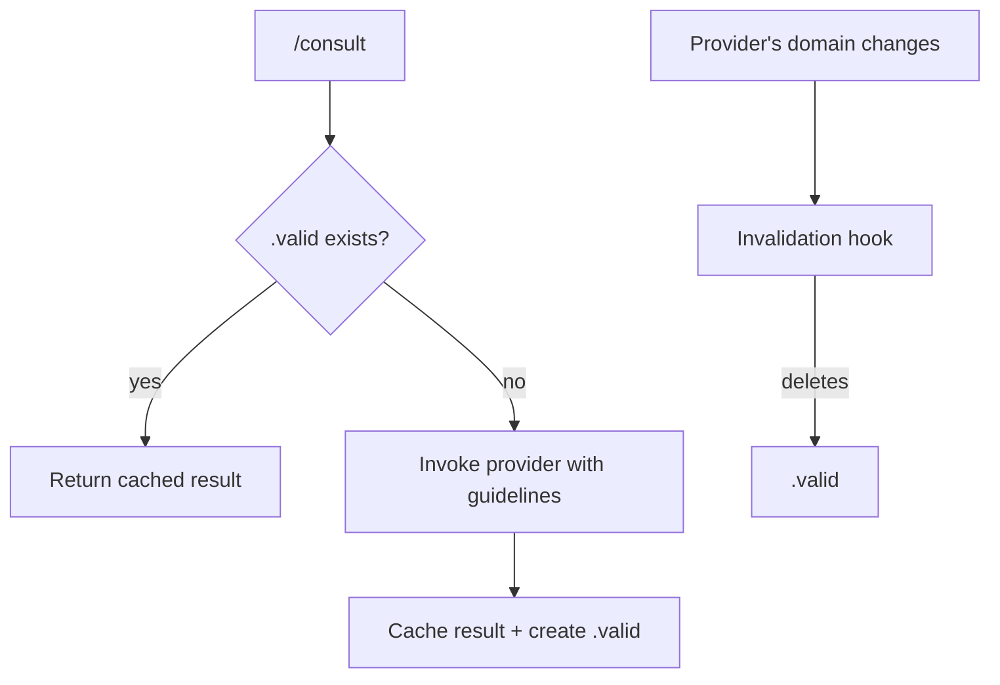

# Kords

A **kord** is a protocol that caches responses from specialized agents. It provides automatic stale detection so agents are only invoked when their knowledge has changed.

Invoking a subagent is expensive — each call takes 10-15 seconds and an API round trip. Without kords, repeated questions to the same agent repeat that cost every time. With kords, the first invocation is cached and reused until the provider's domain changes.

| Concept | What it is | Where it lives | Analogy |
|---------|-----------|----------------|---------|
| **Kord** | Protocol definition | `agents/root/kords/<name>/kord.md` | class |
| **Consultation** | Cached result | `agents/<requester>/memory/dynamic/consultations/<kord>.md` | instance |

## Example

Deployer is about to roll enricher v2.3. Before applying, it needs to know whether monitoring is ready. This is Sauron's domain.

```
/consult monitoring-impact "rolling enricher v2.3 to prod — is monitoring ready?"
```

First time: `/consult` invokes Sauron with the kord's provider guidelines, caches the response. Takes ~15 seconds.

Next time (same question, nothing changed): returns the cached result instantly.

When Sauron's domain changes (new dashboards deployed, alert rules updated): the cache is automatically invalidated. Next `/consult` invokes Sauron again.

??? example "monitoring-impact kord"

    ```markdown
    # monitoring-impact

    Monitoring impact assessment for infrastructure changes.

    ## Requester

    deployer

    ## Provider

    sauron

    ## Provider Guidelines

    Assess monitoring coverage for the affected service.
    Report gaps, not what's already working.
    Keep under 50 lines.

    ### Response Format

    | Field | Required |
    |-------|----------|
    | Gaps by severity (blocking, warning, info) | yes |
    | Missing dashboards or metrics | yes |
    | Missing alerts | yes |
    | Summary | no |
    ```

## Freshness

Each kord has a `.valid` marker. Two hooks control it:

- **Before consulting** — if `.valid` exists, return the cached result. Otherwise invoke the provider.
- **After provider changes** — when the provider's domain changes (files edited, deployments applied), delete `.valid` to force a fresh invocation next time.



## Creating Kords

You don't need to remember the kord template. Just describe what you need — the `.md` guard automatically delegates kord creation to scribe, which enforces the standard structure (Provider Guidelines + Response Format).

```
"create a kord between deployer and sauron for pre-deployment health checks"
```

## Structure

Root owns all kord definitions. Each kord is a directory containing the protocol and a freshness script.

```
agents/root/kords/
├── pattern-review/
│   ├── kord.md           # protocol: requester, provider, guidelines, format
│   ├── freshness.sh      # checks .valid marker
│   └── .valid            # present = cache is fresh
├── monitoring-impact/
│   ├── kord.md
│   └── freshness.sh
└── default-deployer/
    ├── kord.md
    └── freshness.sh
```

Each `kord.md` contains:

| Field | Description |
|-------|-------------|
| **Requester** | Agent(s) that can invoke this kord |
| **Provider** | Agent that answers |
| **Provider Guidelines** | How to respond + response format |

---

??? note "Related commands"

    | Command | Purpose |
    |---------|---------|
    | `/consult pattern-review "prompt"` | Consult via explicit kord |
    | `/consult designer "prompt"` | Consult via default kord |
