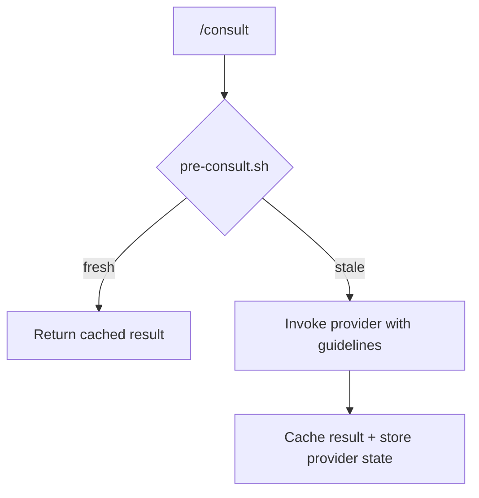

# Kords

## Problem

Dividing work across specialized agents keeps each one focused — but an agent's work can depend on another agent's domain knowledge.

**Sauron** is responsible for monitoring. When invoked on a new repo, it needs answers to key questions:

1. **What infrastructure do we have?**
    - System runs on Kubernetes
    - Grafana at `198.128.3.100:9000`, credentials: xxx
    - Loki at `198.128.3.100:9001`, Prometheus at `198.128.3.100:9002`
    - Shipping via Alloy, configured at `master-alloy.yml`

2. **What design patterns does this app use?**
    - Stream-to-store pattern — reads from Kafka, writes to S3
    - Typical metrics: message throughput, storage growth

Answering these questions requires scanning the repo and the deployment pipeline. The natural solution is to cache them — but how does **Sauron** detect a stale cache when Grafana moves to a new machine? Enter **kords**.

## What is a Kord

A **kord** is a contract between two agents. It defines who provides what, the expected response format, and the criteria for cache invalidation. When an agent needs another agent's knowledge, it consults through a kord — the result is cached and reused until the provider's state changes.

| Concept | What it is | Analogy |
|---------|-----------|---------|
| **Kord** | Contract definition | class |
| **Cached result** | Stored response from provider | instance |

??? example "designer-default kord"

    ```markdown
    ---
    description: General architecture and design questions
    requester: any
    provider: designer
    ---

    ## Provider Guidelines

    Answer concisely — the caller needs facts, not explanations.
    Include specific file paths when referencing components.
    Keep under 50 lines.

    ### Response Format

    | Field | Required |
    |-------|----------|
    | Design pattern identified | yes |
    | Application data flow (inputs → processing → outputs) | yes |
    | Recommended metrics for this pattern | yes |

    ## Provider State Invalidation

    Invalidate when:
    - Application architecture changes
    - New components or services are added
    - Pattern library is updated
    ```

??? example "deployer-default kord"

    ```markdown
    ---
    description: General deployment and cluster questions
    requester: any
    provider: deployer
    ---

    ## Provider Guidelines

    Answer with specific names, endpoints, and configuration paths.
    Keep under 50 lines.

    ### Response Format

    | Field | Required |
    |-------|----------|
    | Infrastructure topology (services, namespaces, dependencies) | yes |
    | Monitoring pipeline (collection → storage → visualization) | yes |
    | Configuration sources (files, ConfigMaps) | if applicable |

    ## Provider State Invalidation

    Invalidate when:
    - Cluster manifests are modified
    - Services are redeployed
    - Monitoring stack configuration changes
    ```

### Cache Freshness

Each kord has a `pre-consult.sh` script maintained by the provider. It runs before every consultation and decides whether the cache is still valid.



### Creating Kords

Just describe what you need. The `.md` guard delegates kord creation to scribe, which asks for any missing details (name, requester, provider) and enforces the standard structure.

```
"create a kord between deployer and sauron for pre-deployment health checks"
```

### Structure

Each kord is a directory containing the contract and a freshness script. Root owns all definitions.

```
agents/root/kords/
├── pattern-review/
│   ├── kord.md             # contract
│   └── pre-consult.sh      # freshness check
├── monitoring-impact/
│   ├── kord.md
│   └── pre-consult.sh
└── deployer-default/
    ├── kord.md
    └── pre-consult.sh
```

---

??? note "Related commands"

    | Command | Purpose |
    |---------|---------|
    | `/consult pattern-review "prompt"` | Consult via explicit kord |
    | `/consult designer "prompt"` | Consult via default kord |
