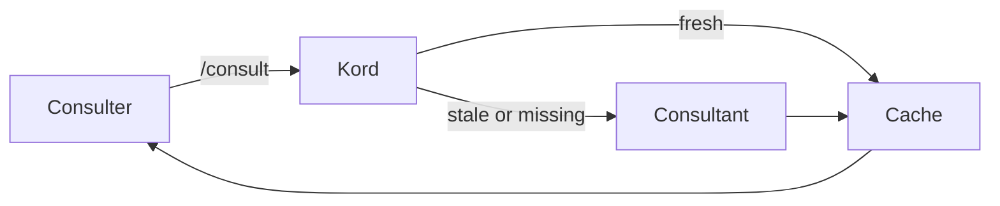

# Kords

A **kord** is a single consultation link between two agents — not the entire relationship, but one specific thing one agent provides to another. Two agents can be linked by multiple kords, each addressing a different need.

A kord defines the **template** of a response (like a class). The cache file holds the **actual response** (like an instance). A default kord exists for free-form inquiries that don't fit a specific template.

## Ownership & Structure

Root owns all kord definitions centrally in `agents/root/kords/`. Each kord is its own file. A registry file lists all agents with brief descriptions.

**Naming:** `<consulter>-<consultant>-<topic>.md` — Default kords: `default-<consultant>.md`

```
agents/root/kords/
├── registry.md
├── deployer-designer-pattern-review.md
├── deployer-designer-architecture-constraints.md
├── deployer-sauron-monitoring-impact.md
├── sauron-designer-monitoring-perspective.md
└── default-designer.md
```

## Kord as Multi-Reader Source of Truth

A kord file is read by different agents who extract different sections:

| Reader | Extracts | Purpose |
|--------|----------|---------|
| Consulter | Template, Script | Know what to expect, check cache cheaply |
| Consultant | Guidelines, Rules | Know how to answer, evaluate deeper freshness |
| `/scribe:kord` | All fields | Create/edit the full definition |

## Definition Fields

| Field | Reader | Description |
|-------|--------|-------------|
| **Consulter** | Both | Agent asking |
| **Consultant** | Both | Agent answering |
| **Provides** | Both | What this kord delivers |
| **Template** | Consulter | Shape of the expected response |
| **Script** | Consulter | Cheap local freshness check (file hashes, timestamps, etc.) |
| **Guidelines** | Consultant | How to answer — sources, format, constraints |
| **Rules** | Consultant | Deeper freshness logic, cross-kord invalidation |

??? example "deployer → designer: pattern review"

    ```markdown
    # Kord: deployer → designer (pattern review)

    | Field | Value |
    |-------|-------|
    | **Consulter** | deployer |
    | **Consultant** | designer |
    | **Provides** | Pattern compliance review for a proposed deployment |

    ## Template

    - **Compliant patterns:** list
    - **Violations:** list with severity
    - **Suggestions:** optional remediation steps

    ## Script

    sha256sum agents/designer/patterns/*.md

    ## Guidelines

    Check the deployment manifest against the pattern library in
    `agents/designer/patterns/`. Report violations by severity
    (blocking, warning, info). Keep response under 40 lines.

    ## Rules

    Stale when any file in `agents/designer/patterns/` changes.
    Invalidates `deployer-designer-architecture-constraints` if
    a blocking violation is found.
    ```

## Flow

1. Agent wants to consult.
2. Check cache for this specific kord.
3. Fresh → read cache. Stale or missing → spawn consultant, cache result.



## Freshness & Invalidation

Four layers, from cheapest to most disruptive:

| Layer | Trigger | Who runs it |
|-------|---------|-------------|
| **Script** | On read — consulter runs locally, no spawn needed | Consulter (passive) |
| **Rules** | When consultant is already spawned for another reason | Consultant (opportunistic) |
| **`/invalidate`** | User manually forces stale | User |
| **Event-driven** | Hooks (e.g., post-deploy) invalidate specific kords | System |

## Using a Kord

=== "Explicit"

    Target a specific kord by name:

    ```
    /consult designer:pattern-review "is the sidecar compliant?"
    ```

=== "Default"

    Free-form question routed through the default kord:

    ```
    /consult designer "free-form question"
    ```

    Uses `default-designer.md`.

## Agent Awareness

Agents discover their kords through three mechanisms:

1. **Dynamic memory file** — a script scans `agents/root/kords/` for kords involving the agent and generates a summary of available kords and connected agents.
2. **Hook on kord directory** — fires when any file in `agents/root/kords/` changes, regenerating the dynamic memory file.
3. **Guard** — blocks the agent from acting until it re-reads the updated memory file.

No staleness, no injection timing issues. The guard ensures agents never act on outdated kord knowledge.
