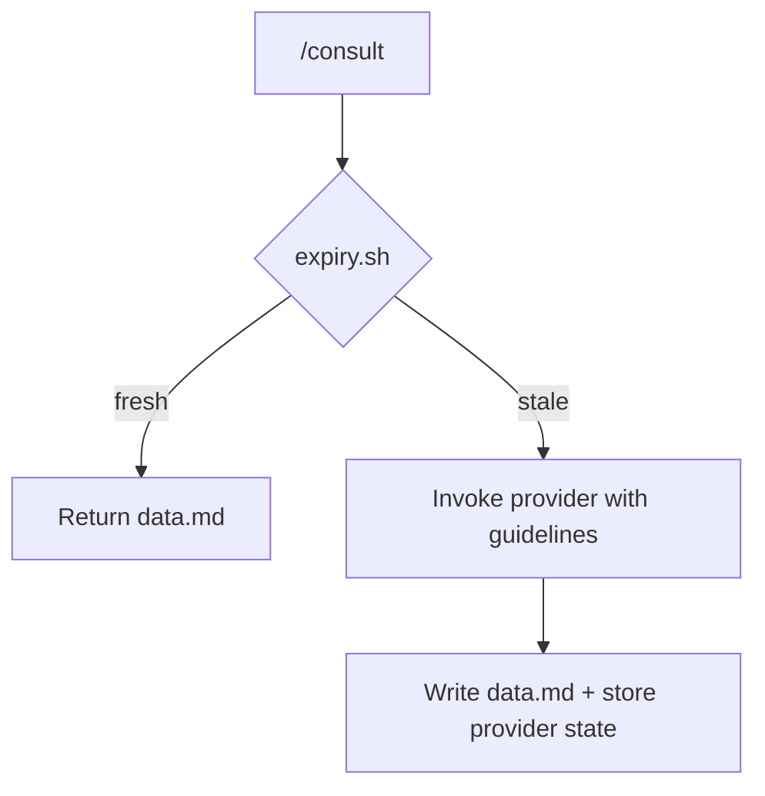

# Kords

A **kord** is a contract between two agents. See [Overview](overview.md#problem) for why kords exist.

??? example "designer-default kord"

    ```markdown
    ---
    description: General architecture and design questions
    requester: any
    provider: designer
    ---

    ## Provider Guidelines

    Answer concisely — the caller needs facts, not explanations.
    Include specific file paths when referencing components.
    Keep under 50 lines.

    ### Response Format

    | Field | Required |
    |-------|----------|
    | Design pattern identified | yes |
    | Application data flow (inputs → processing → outputs) | yes |
    | Recommended metrics for this pattern | yes |

    ## Provider State Invalidation

    Invalidate when:
    - Application architecture changes
    - New components or services are added
    - Pattern library is updated
    ```

??? example "deployer-default kord"

    ```markdown
    ---
    description: General deployment and cluster questions
    requester: any
    provider: deployer
    ---

    ## Provider Guidelines

    Answer with specific names, endpoints, and configuration paths.
    Keep under 50 lines.

    ### Response Format

    | Field | Required |
    |-------|----------|
    | Infrastructure topology (services, namespaces, dependencies) | yes |
    | Monitoring pipeline (collection → storage → visualization) | yes |
    | Configuration sources (files, ConfigMaps) | if applicable |

    ## Provider State Invalidation

    Invalidate when:
    - Cluster manifests are modified
    - Services are redeployed
    - Monitoring stack configuration changes
    ```

### Cache Freshness

Each kord has a `expiry.sh` script maintained by the provider. It runs before every consultation and decides whether the cache is still valid.



### Creating Kords

Just describe what you need. The `.md` guard delegates kord creation to scribe, which asks for any missing details (name, requester, provider) and enforces the standard structure.

```
"create a kord between deployer and sauron for pre-deployment health checks"
```

### Structure

Each kord is a directory inside `kord/` containing the contract, cached data, and a freshness script.

```
~/.claude/kord/                     # global scope
├── KORD.md                         # knowledge registry
├── pattern-review/
│   ├── contract.md                 # protocol definition
│   ├── data.md                     # cached result
│   └── expiry.sh                   # expiry check
├── monitoring-impact/
│   ├── contract.md
│   ├── data.md
│   └── expiry.sh
└── deployer-default/
    ├── contract.md
    ├── data.md
    └── expiry.sh
```

??? note "Templates"

    **contract.md** — consultation protocol:

    ```markdown
    ---
    description: <what this kord provides>
    requester: <agent or "any">
    provider: <agent>
    ---

    ## Provider Guidelines

    <Instructions for how the provider should respond.>

    ### Response Format

    | Field | Required |
    |-------|----------|
    | <field> | yes/no |

    ## Provider State Invalidation

    Invalidate when:
    - <condition>
    ```

    **data.md** — follows the Response Format from contract.md:

    ```markdown
    <field>: <value>
    <field>: <value>
    ```
