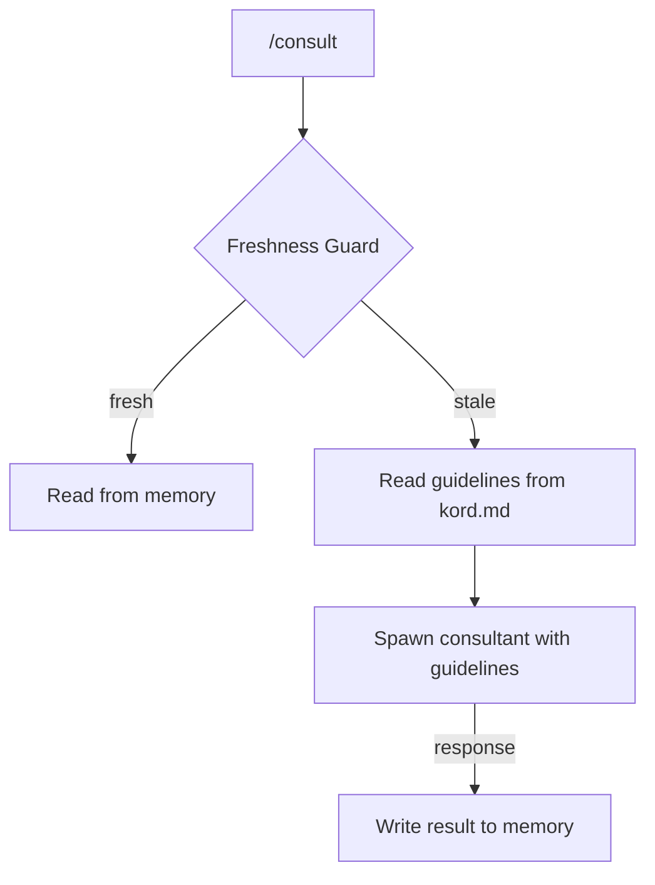

# Kords

A **kord** is a single consultation link between two agents — a template that defines one specific thing one agent provides to another. Two agents can be linked by multiple kords. A default kord exists for free-form queries.

| Concept | What it is | Where it lives | Nature |
|---------|-----------|----------------|--------|
| **Kord** | Template/protocol | `agents/root/kords/<name>/kord.md` | Static, root-owned |
| **Consultation result** | Actual knowledge | `agents/<consulter>/memory/dynamic/consultations/<result>.md` | Dynamic, consulter-owned |

The kord is the template (like a class). The consultation result is the actual knowledge (like an instance).

## Structure

Each `kord.md` contains:

| Field | Description |
|-------|-------------|
| **Consulter** | Agent asking |
| **Consultant** | Agent answering |
| **Provides** | What this kord delivers |
| **Guidelines** | How to answer — sources, format, constraints |

??? example "deployer → designer: pattern review"

    ```markdown
    # Kord: deployer → designer (pattern review)

    | Field | Value |
    |-------|-------|
    | **Consulter** | deployer |
    | **Consultant** | designer |
    | **Provides** | Pattern compliance review for a proposed deployment |

    ## Guidelines

    Check the deployment manifest against the pattern library in
    `agents/designer/patterns/`. Report violations by severity
    (blocking, warning, info). Keep response under 40 lines.

    ```

Root owns all kord definitions. Each kord is a directory containing the definition and a freshness script. A registry file lists all agents with brief descriptions.

**Naming:** `<consulter>-<consultant>-<topic>/` — Default kords: `default-<consultant>/`

```
agents/root/kords/
├── registry.md
├── deployer-designer-pattern-review/
│   ├── kord.md                              # template definition
│   └── freshness.sh                         # owned by consultant
├── deployer-sauron-monitoring-impact/
│   ├── kord.md
│   └── freshness.sh
└── default-designer/
    ├── kord.md
    └── freshness.sh
```

Consultation results live in the consulter's dynamic memory:

```
agents/deployer/memory/dynamic/
└── consultations/
    ├── designer-pattern-review.md
    └── sauron-monitoring-impact.md
```

These are real knowledge — accessible anytime without `/consult`.

## Freshness

Each kord includes a freshness script owned by the consultant. It returns a simple boolean — is the consultation result still fresh? The consultant decides what criteria make a result stale (file changes, time, external state). The consulter just runs it to decide whether to use the existing result or spawn the consultant for a new one.



1. Agent calls `/consult designer:pattern-review "question"` (or `/consult designer "question"` for default kord)
2. **Freshness Guard** fires as a pre-hook — runs `freshness.sh` from the kord directory
3. **Fresh** → guard blocks, agent reads the result from its own dynamic memory. No spawn.
4. **Stale** → guard allows `/consult` to proceed
5. `/consult` reads the Guidelines section from `kord.md` and spawns the consultant, passing the guidelines
6. Consultant follows the guidelines, produces result
7. Result written to consulter's `consultations/` directory

### Layers

Freshness has two layers:

| Layer | Who runs it | When |
|-------|-------------|------|
| **Freshness Guard** | Pre-hook on `/consult` | Every consultation — runs `freshness.sh`, blocks if fresh |
| **Event-driven** | Hooks | On events (e.g. post-deploy) invalidate specific kords |

## Kord Discovery

Agents know their kords without reading them on every action:

1. **Consulter Awareness Script** — scans `agents/root/kords/` for kords involving this agent, extracts Consulter/Consultant/Provides fields, generates a summary in dynamic memory
2. **Hook on kord directory** — fires when kord files change, regenerates the summary
3. **Guard** — blocks agent until it re-reads the updated summary

??? note "Related commands"

    | Command | Purpose |
    |---------|---------|
    | `/scribe:kord deployer designer` | Create a new kord |
    | `/scribe:onboard designer` | Onboard a new agent |
    | `/consult designer:pattern-review "question"` | Consult via explicit kord |
    | `/consult designer "question"` | Consult via default kord |
