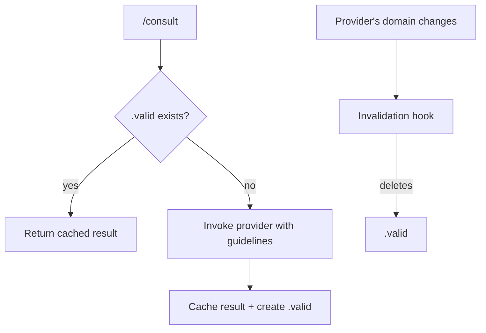

# Kords

## Problem

Dividing work across specialized agents keeps each one focused — but an agent's work can depend on another agent's domain knowledge.

**Sauron** is responsible for monitoring. When invoked on a new repo, it needs answers to key questions:

1. **What infrastructure do we have?**
    - System runs on Kubernetes
    - Grafana at `198.128.3.100:9000`, credentials: xxx
    - Loki at `198.128.3.100:9001`, Prometheus at `198.128.3.100:9002`
    - Shipping via Alloy, configured at `master-alloy.yml`

2. **What design patterns does this app use?**
    - Stream-to-store pattern — reads from Kafka, writes to S3
    - Typical metrics: message throughput, storage growth

Answering these questions requires scanning the repo and the deployment pipeline. The natural solution is to cache them — but how does **Sauron** detect a stale cache when Grafana moves to a new machine?

## What is a Kord

**Sauron** delegates these questions to specialized agents (**Deployer**, **Designer**). Each relationship is defined by a **kord** — a contract that specifies the provider, the requester, and the expected response format.

| Concept | What it is | Where it lives | Analogy |
|---------|-----------|----------------|---------|
| **Kord** | Contract definition | `agents/root/kords/<name>/kord.md` | class |
| **Consultation** | Cached result | `agents/<requester>/memory/dynamic/consultations/<kord>.md` | instance |

??? example "default-deployer kord (sauron asking deployer about infrastructure)"

    ```markdown
    # default-deployer

    General deployment and cluster questions.

    ## Requester

    any

    ## Provider

    deployer

    ## Provider Guidelines

    Answer with specific names, versions, and states.
    Keep under 50 lines.

    ### Response Format

    | Field | Required |
    |-------|----------|
    | Current state (pods, versions, resources) | yes |
    | Relevant configuration (services, ingresses) | if applicable |
    | Recent changes | if applicable |
    ```

### Cache Rehydration

Each kord has a `.valid` marker. Two hooks control it:

- **Before consulting** — if `.valid` exists, return the cached result. Otherwise invoke the provider.
- **After provider changes** — when the provider's domain changes (files edited, deployments applied), delete `.valid` to force a fresh invocation next time.



### Creating Kords

Just describe what you need. The `.md` guard delegates kord creation to scribe, which asks for any missing details (name, requester, provider) and enforces the standard structure.

```
"create a kord between deployer and sauron for pre-deployment health checks"
```

### Structure

Root owns all kord definitions. Each kord is a directory containing the contract and a freshness script.

```
agents/root/kords/
├── pattern-review/
│   ├── kord.md           # contract: requester, provider, guidelines, format
│   ├── freshness.sh      # checks .valid marker
│   └── .valid            # present = cache is fresh
├── monitoring-impact/
│   ├── kord.md
│   └── freshness.sh
└── default-deployer/
    ├── kord.md
    └── freshness.sh
```

---

??? note "Related commands"

    | Command | Purpose |
    |---------|---------|
    | `/consult pattern-review "prompt"` | Consult via explicit kord |
    | `/consult designer "prompt"` | Consult via default kord |
