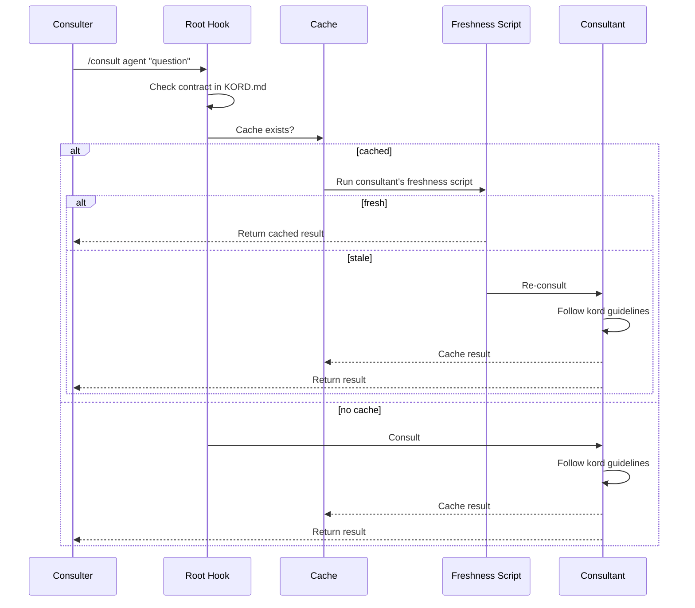

# Kords

A **kord** is a consultation protocol between two agents. It has two parts:

- **Kord Contract** — the interface. What can be asked, what's provided, in what format. Owned by [root](root.md), defined in `KORD.md`.
- **Kord Guidelines** — the implementation. How the consultant answers, freshness rules, response procedures. Owned by each consultant agent.

Without kords, agents are isolated specialists. Kords are what make them a team.



## Contract

The shared interface between two agents. Lives in root's `KORD.md`.

| Field | Description |
|-------|-------------|
| **Consulter** | The agent asking |
| **Consultant** | The agent answering |
| **Provides** | What the consultant offers — specific items with expected format |
| **Additional Notes** | Open-ended guidance for queries outside the structured list |

??? abstract "Example: deployer → designer"

    | Field | Value |
    |-------|-------|
    | **Consulter** | deployer |
    | **Consultant** | designer |

    **Provides:**

    - Pattern deployment perspective — checklist of pattern compliance
    - Architecture constraints — list of violations or concerns
    - Data flow impact — affected components and connections

    **Additional Notes:**

    Any architecture question related to a deployment change. Designer answers from its pattern library and project architecture knowledge.

Define a new contract:

```
/scribe:kord deployer designer
```

Scribe walks through the format interactively — who provides what, in what format, and any additional notes.

## Guidelines

The consultant's implementation. Lives in the agent's own files (e.g. `instructions/consultation.md`). The consultant decides:

- **How to answer** — what sources to check, response format, line limits
- **Freshness** — a standard script (`hooks/freshness.sh`) that runs when a cached result is read. Returns fresh or stale based on whatever criteria the consultant defines (file hashes, time, external state).

The consulter never sees the guidelines — it only interacts with the contract.

## Using a kord

```
/consult <agent> "<question>"
```

Consults an agent — the consultant answers using its memory without taking over the conversation. The consulter keeps control. Results are cached — `/invalidate <agent>` forces a fresh answer regardless of the freshness script.

This differs from **delegation**, where the consulter hands off work entirely and the delegated agent takes action (writes files, runs commands, etc.).
