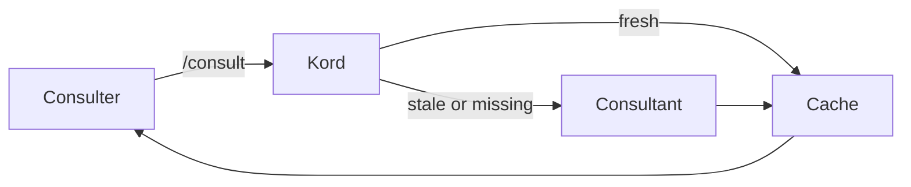

# Kords

A **kord** is a single consultation link between two agents — not the entire relationship, but one specific thing one agent provides to another. Two agents can be linked by multiple kords, each addressing a different need.

A kord defines the **template** of a response (like a class). The cache file holds the **actual response** (like an instance). There is also a default kord for free-form inquiries that don't fit a specific template.



## Definition

Each kord is a self-contained file with these fields:

| Field | Description |
|-------|-------------|
| **Consulter** | Agent asking |
| **Consultant** | Agent answering |
| **Provides** | What this kord delivers |
| **Template** | Shape of the response |
| **Guidelines** | How to answer — sources to check, format, constraints |
| **Freshness** | Script or rules for cache validity |

??? example "deployer → designer: pattern review"

    ```markdown
    # Kord: deployer → designer (pattern review)

    | Field | Value |
    |-------|-------|
    | **Consulter** | deployer |
    | **Consultant** | designer |
    | **Provides** | Pattern compliance review for a proposed deployment |

    ## Template

    - **Compliant patterns:** list
    - **Violations:** list with severity
    - **Suggestions:** optional remediation steps

    ## Guidelines

    Check the deployment manifest against the pattern library in
    `agents/designer/patterns/`. Report violations by severity
    (blocking, warning, info). Keep response under 40 lines.

    ## Freshness

    Stale when any file in `agents/designer/patterns/` changes
    or the deployment manifest is modified.
    ```

## Ownership

Root owns all kord definitions centrally in `agents/root/kords/`. Each kord is its own file.

**Naming convention:** `<consulter>-<consultant>-<topic>.md`

**Default kords:** `default-<consultant>.md` — handles free-form questions.

```
agents/root/kords/
├── deployer-designer-pattern-review.md
├── deployer-designer-architecture-constraints.md
├── deployer-sauron-monitoring-impact.md
├── sauron-designer-monitoring-perspective.md
└── default-designer.md
```

## Flow

1. Agent wants to consult.
2. Check cache for this specific kord.
3. Fresh → read cache. Stale or missing → spawn consultant, cache result.

## Commands

`/scribe:kord` creates a new kord definition file.

`/consult` executes a kord — the consultant answers using its memory without taking over the conversation. Results are cached.
