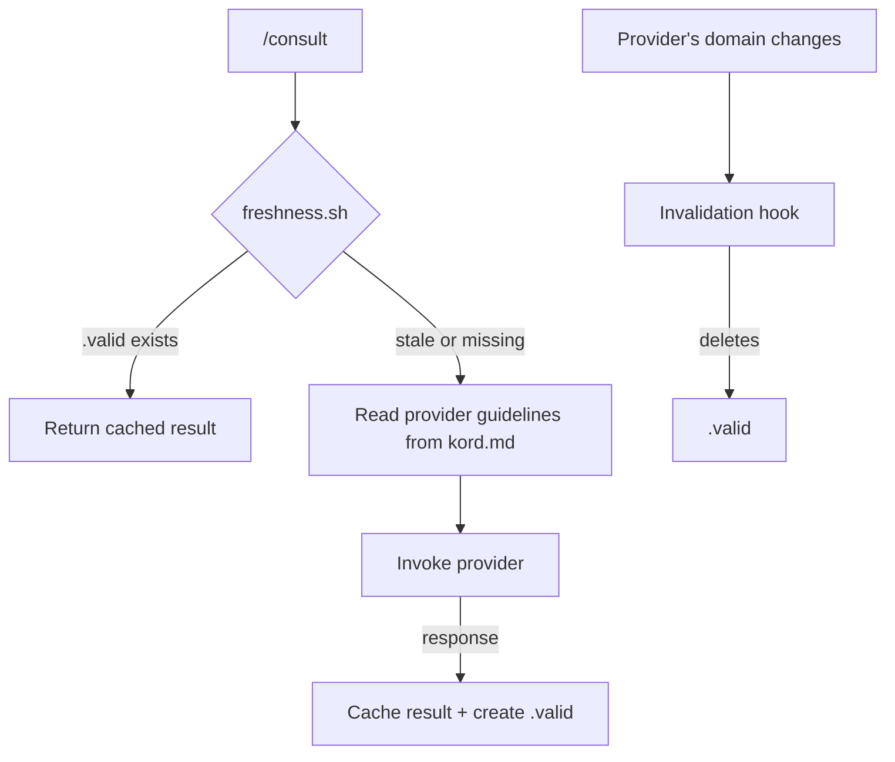

# Kords

A **kord** is a consultation protocol between two agents — it defines what one agent provides as a service to another, how to respond, and what format to use. Two agents can be linked by multiple kords. A default kord exists for free-form queries.

| Concept | What it is | Where it lives | Nature | Analogy |
|---------|-----------|----------------|--------|---------|
| **Kord** | Template/protocol | `agents/root/kords/<name>/kord.md` | Static, root-owned | class |
| **Consultation** | Actual knowledge | `agents/<requester>/memory/dynamic/consultations/<result>.md` | Dynamic, requester-owned | instance |

## Example

Deployer is about to roll a new service version. Before applying, it needs to know whether monitoring is ready — are dashboards, alerts, and health checks in place? This is Sauron's domain, not Deployer's.

```
/consult monitoring-impact "rolling enricher v2.3 to prod — is monitoring ready?"
```

`/consult` resolves the `monitoring-impact` kord, checks freshness, invokes Sauron with the kord's provider guidelines, caches the response, and returns it. The cached result is reused until Sauron's knowledge changes.

??? example "monitoring-impact kord"

    ```markdown
    # monitoring-impact

    Monitoring impact assessment for infrastructure changes.

    ## Requester

    deployer

    ## Provider

    sauron

    ## Provider Guidelines

    Assess monitoring coverage for the affected service.
    Report gaps, not what's already working.
    Keep under 50 lines.

    ### Response Format

    | Field | Required |
    |-------|----------|
    | Gaps by severity (blocking, warning, info) | yes |
    | Missing dashboards or metrics | yes |
    | Missing alerts | yes |
    | Summary | no |
    ```

## Creating Kords

You don't need to remember the kord template. Just describe what you need — the `.md` guard automatically delegates kord creation to scribe, which enforces the standard structure (Provider Guidelines + Response Format).

```
"create a kord between deployer and sauron for pre-deployment health checks"
```

## Structure

Root owns all kord definitions. Each kord is a directory containing the protocol and a freshness script.

**Naming:** kord directories are named by topic. Default kords: `default-<provider>/`

```
agents/root/kords/
├── registry.md
├── pattern-review/
│   ├── kord.md                              # protocol definition
│   ├── freshness.sh                         # checks .valid marker
│   └── .valid                               # marker — deleted to invalidate
├── monitoring-impact/
│   ├── kord.md
│   └── freshness.sh
└── default-designer/
    ├── kord.md
    └── freshness.sh
```

Consultations live in the requester's dynamic memory:

```
agents/deployer/memory/dynamic/
└── consultations/
    ├── pattern-review.md
    └── monitoring-impact.md
```

Each `kord.md` contains:

| Field | Description |
|-------|-------------|
| **Requester** | Agent(s) that can invoke this kord |
| **Provider** | Agent that answers |
| **Provider Guidelines** | Behavioral instructions + response format |

## Consultation Freshness

Each kord directory contains a `.valid` marker and a `freshness.sh` script. Freshness is controlled by two hooks:

- **Pre-consult** (requester side) — runs `freshness.sh` before every consultation. If `.valid` exists, returns the cached result. Otherwise invokes the provider.
- **Post-event** (provider side) — runs after changes that affect the provider's domain (e.g. post-deploy, config change). Deletes `.valid` to force a fresh consultation next time.



---

??? note "Related commands"

    | Command | Purpose |
    |---------|---------|
    | `/consult pattern-review "question"` | Consult via explicit kord |
    | `/consult designer "question"` | Consult via default kord |
