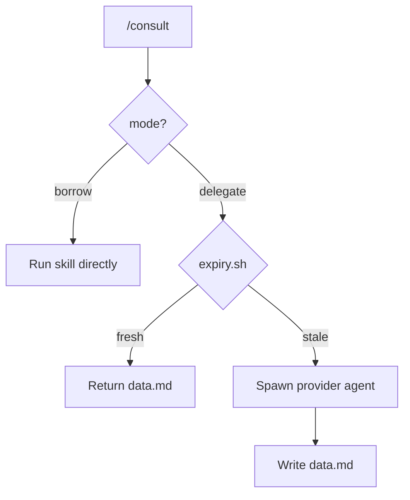

# Kords

A **kord** is a contract between two agents. See [Overview](overview.md#problem) for why kords exist.

## Modes

Each kord specifies how the provider fulfills the request:

- **`borrow`** — the requester runs the provider's skill directly. No agent spawn. Fast, stateless. Use for simple actions like writing memory or authenticating.
- **`delegate`** — the requester hands off to the full provider agent (via Beorn or native subagent). The agent has identity, memory, skills, full context. Use for work requiring domain knowledge.

??? example "borrow — scribe:remember"

    ```markdown
    ---
    description: Write a memory for an agent
    requester: any
    provider: scribe
    mode: borrow
    skill: remember
    ---
    ```

    The requester invokes `/scribe:remember` directly — no scribe agent spawned.

??? example "delegate — deployer-default"

    ```markdown
    ---
    description: General deployment and cluster questions
    requester: any
    provider: deployer
    mode: delegate
    ---

    ## Provider Guidelines

    Answer with specific names, endpoints, and configuration paths.
    Keep under 50 lines.

    ### Response Format

    | Field | Required |
    |-------|----------|
    | Infrastructure topology (services, namespaces, dependencies) | yes |
    | Monitoring pipeline (collection → storage → visualization) | yes |
    | Configuration sources (files, ConfigMaps) | if applicable |

    ## Provider State Invalidation

    Invalidate when:
    - Cluster manifests are modified
    - Services are redeployed
    - Monitoring stack configuration changes
    ```

### Cache Freshness

Delegate-mode kords cache results. Each kord can have an `expiry.sh` script that checks if the cache is still valid.



### Creating Kords

Describe what you need. Scribe creates the contract:

```
/scribe:kord pattern-review "architecture review for deployment changes"
```

### Structure

Kords live at `$KORDINATE_HOME/kords/`:

```
$KORDINATE_HOME/kords/
├── pattern-review/
│   ├── contract.md         # protocol definition
│   ├── data.md             # cached result (delegate mode)
│   └── expiry.sh           # freshness check (optional)
├── scribe-remember/
│   └── contract.md         # borrow mode — no data.md needed
└── deployer-default/
    ├── contract.md
    ├── data.md
    └── expiry.sh
```

??? note "Contract template"

    ```markdown
    ---
    description: <what this kord provides>
    requester: <agent or "any">
    provider: <agent>
    mode: <borrow or delegate>
    skill: <skill-name>          # required if mode is borrow
    ---

    ## Provider Guidelines

    <Instructions for how the provider should respond.>

    ### Response Format

    | Field | Required |
    |-------|----------|
    | <field> | yes/no |

    ## Provider State Invalidation

    Invalidate when:
    - <condition>
    ```
