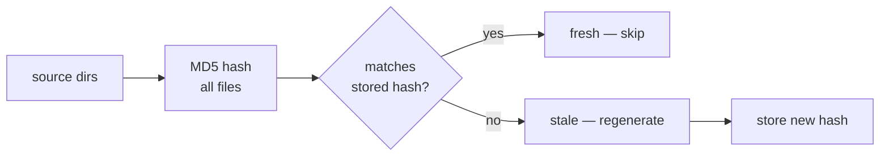

# 2D Memory

Every agent has two layers: **identity** (KORD.md) and **knowledge** (2D memory).

## KORD.md — Identity

Each agent's `KORD.md` defines who it is. Read once, rarely changes.

| Section | What it contains |
|---------|-----------------|
| **Description** | One-line role definition |
| **Commands** | Slash commands the agent owns |
| **Rules** | Behavioral constraints |
| **Consultation** | What it answers when consulted |

Root agent's `KORD.md` additionally contains the team routing table (which agents exist, their triggers) and team-wide rules inherited by all subagents.

## Per-Agent Knowledge

Each agent's knowledge is organized on two axes — **scope** and **mutability**:

| | Static (pre-defined structure) | Dynamic (free-form) |
|---|---|---|
| **Global** | `agents/<agent>/memory/static/` | `agents/<agent>/memory/dynamic/` |
| **Project** | `<project>/<agent>/static/` | `<project>/<agent>/dynamic/` |

**Static** holds content with pre-defined structure — pattern definitions, infrastructure docs, dashboard schemas. Committed and reviewed.

**Dynamic** holds free-form agent notes — operational findings, session state, consultation caches. Auto-managed by agents.

### Agent skeleton

Every agent has this structure. Static and dynamic dirs may be empty for new agents.

```
agents/<agent>/
├── KORD.md               # identity
├── instructions/
│   └── consultation.md   # consultation behavior + cache sources
├── memory/
│   ├── static/           # pre-defined structure
│   └── dynamic/          # free-form
└── commands/             # slash command definitions
```

Project-level memory follows the same split:

```
<project>/<agent>/
├── static/               # pre-defined structure (manifests, dashboards)
└── dynamic/              # free-form (operational notes, findings)
```

How these files are loaded into the runtime is handled by the [linking layer](../reference/linking.md#memory-mapping).

## Cache System

The `lib/cache.sh` library provides hash-based invalidation — hashes source directories and skips regeneration if unchanged.



Used by memory regeneration, consultation caching, and doc audit.

Each agent declares which directories matter for its cache in `## Cache Sources` of `instructions/consultation.md`. A hook auto-invalidates when those files change. Manual override: `/invalidate <agent>`.

| Function | Purpose |
|----------|---------|
| `cache_hash <dirs...>` | Compute MD5 of all files in given directories |
| `cache_check <hash_file> <dirs...>` | Returns 0 if fresh, 1 if stale |
| `cache_store <hash_file> <dirs...>` | Store current hash |
| `cache_invalidate <hash_file>` | Remove hash to force regeneration |
