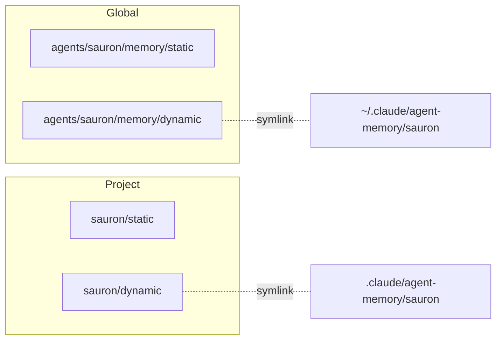
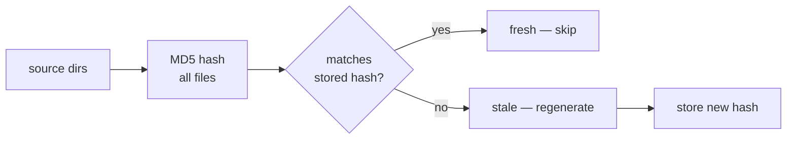

# 2D Memory

Every agent has two layers: **identity** (AGENT.md) and **knowledge** (2D memory).

## AGENT.md — Identity

Each agent's `AGENT.md` defines who it is. Read once, rarely changes.

| Section | What it contains |
|---------|-----------------|
| **Description** | One-line role definition |
| **Commands** | Slash commands the agent owns |
| **Rules** | Behavioral constraints |
| **Consultation** | What it answers when consulted |

Root agent's `AGENT.md` additionally contains the team routing table (which agents exist, their triggers) and team-wide rules inherited by all subagents.

## Per-Agent Knowledge

Each agent's knowledge is organized on two axes — **scope** and **mutability**:

| | Static (pre-defined structure) | Dynamic (free-form) |
|---|---|---|
| **Global** | `agents/<agent>/memory/static/` | `agents/<agent>/memory/dynamic/` |
| **Project** | `<project>/<agent>/static/` | `<project>/<agent>/dynamic/` |

**Static** holds content with pre-defined structure — pattern definitions, infrastructure docs, dashboard schemas. Committed and reviewed.

**Dynamic** holds free-form agent notes — operational findings, session state, consultation caches. Auto-managed by agents.

The linking layer maps dynamic dirs into the runtime's expected paths:



=== "Global"

    ```
    agents/<agent>/
    ├── AGENT.md              # role, commands, rules
    ├── instructions/         # procedures (workflow, auth, tools)
    ├── memory/
    │   ├── static/           # pre-defined structure
    │   └── dynamic/          # free-form (auto-generated MEMORY.md, notes)
    └── commands/             # slash command definitions
    ```

=== "Project"

    ```
    <project>/<agent>/
    ├── static/               # pre-defined structure (manifests, dashboards)
    └── dynamic/              # free-form (operational notes, findings)
    ```

??? abstract "How memory is assembled at spawn"

    At spawn, `agent-memory.sh` assembles a single `MEMORY.md` from the agent's 2D memory plus two additional sources:

    - **Team memory** (`agents/shared/MEMORY.md`) — common rules and consultation directory, injected into every agent
    - **Instructions** (`agents/<agent>/instructions/*.md`) — agent-specific procedures

    ```mermaid
    flowchart TD
        SP[agent spawn] --> HC{sources changed?}
        HC -->|no| SK[skip — cached MEMORY.md is fresh]
        HC -->|yes| GEN[regenerate MEMORY.md]
        GEN --> ST[store new hash]
        ST --> SK
    ```

    | Source | How it's included |
    |--------|------------------|
    | `shared/MEMORY.md` | Always inlined — team rules for all agents |
    | `instructions/*.md` | Always inlined — agent-specific procedures |
    | `memory/static/*.md` | Inlined if ≤500 lines, indexed if larger |
    | Previous `## Notes` | Preserved — Claude's auto-managed section |

## Cache System

The `lib/cache.sh` library provides hash-based invalidation — hashes source directories and skips regeneration if unchanged.



### What's cached

| Consumer | What it caches | Hash stored at |
|----------|---------------|----------------|
| `agent-memory.sh` | Generated MEMORY.md per agent | `memory/dynamic/.hash` |
| `/consult` | Consultation answers per agent pair | `agents/shared/memory/dynamic/.<consulter>-<consultant>.hash` |
| `/scribe:audit-docs` | Doc freshness per page | `docs/.source-hashes/` |

### Invalidation

Each agent (consultant) declares which directories to hash in `## Cache Sources` of its `instructions/consultation.md`. When those files change, cached answers become stale.

A `PostToolUse` hook (`invalidate-consultation.sh`) auto-invalidates: after any Edit/Write, it checks if the modified file falls within an agent's declared cache sources and removes the corresponding hash files.

Manual: `/invalidate <agent>` force-clears all cached answers from that agent.

### Functions

| Function | Purpose |
|----------|---------|
| `cache_hash <dirs...>` | Compute MD5 of all files in given directories |
| `cache_check <hash_file> <dirs...>` | Returns 0 if fresh, 1 if stale |
| `cache_store <hash_file> <dirs...>` | Store current hash |
| `cache_invalidate <hash_file>` | Remove hash to force regeneration |
