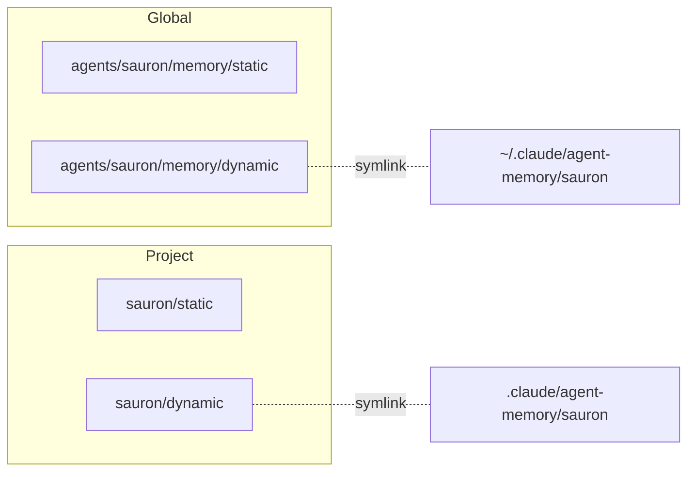
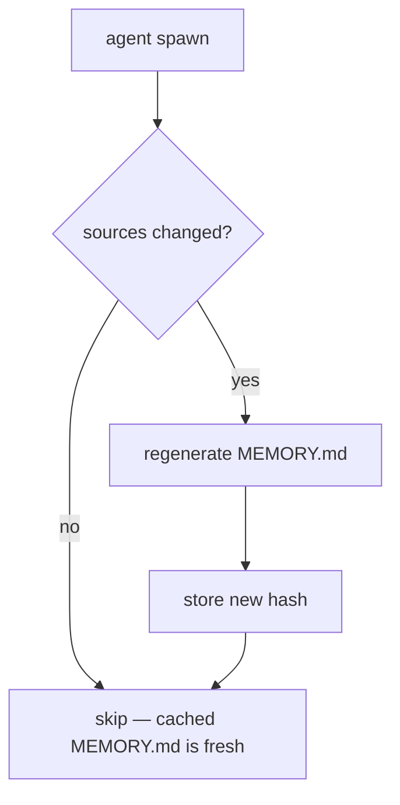
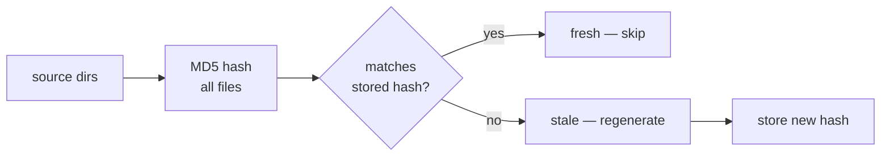

# Memory

How agents store and discover knowledge.

## Memory Model

Two axes — **scope** and **mutability**:

| | Static (pre-defined structure) | Dynamic (free-form) |
|---|---|---|
| **Global** | `agents/<agent>/memory/static/` | `agents/<agent>/memory/dynamic/` |
| **Project** | `<project>/<agent>/static/` | `<project>/<agent>/dynamic/` |

**Static** holds content with pre-defined structure — pattern definitions, k8s manifests, dashboard schemas. Committed and reviewed.

**Dynamic** holds free-form agent notes — operational findings, session state, consultation caches. Auto-managed by agents.

The same structure applies at both scopes. The linking layer maps dynamic dirs into the runtime's expected paths:



## Per-Agent Structure

=== "Global"

    ```
    agents/<agent>/
    ├── AGENT.md              # role, commands, rules
    ├── instructions/         # procedures (workflow, auth, tools)
    ├── memory/
    │   ├── static/           # pre-defined structure (patterns, infra docs)
    │   └── dynamic/          # free-form (auto-generated MEMORY.md, notes)
    └── commands/             # slash command definitions
    ```

=== "Project"

    ```
    <project>/<agent>/
    ├── static/               # pre-defined structure (manifests, dashboards)
    └── dynamic/              # free-form (operational notes, findings)
    ```

    Only agents that produce project-level content get dirs. Currently: deployer (`manifests/` equivalent), sauron (`monitoring/` equivalent).

## How Agents Get Context

The `agent-memory.sh` hook fires before every agent spawn. It assembles a single `MEMORY.md` in the agent's dynamic dir — the file Claude auto-loads on startup.



??? info "What gets assembled"

    | Source | How it's included |
    |--------|------------------|
    | `shared/MEMORY.md` | Always inlined — common rules for all agents |
    | `instructions/*.md` | Always inlined — agent-specific procedures |
    | `memory/static/*.md` | Inlined if ≤500 lines, indexed if larger |
    | Previous `## Notes` | Preserved — Claude's auto-managed section |

    The agent gets full context on startup without needing to read files itself.

## Cache System

The `lib/cache.sh` library provides hash-based invalidation — a primitive used across the framework to detect when source files have changed.

### How it works



Each consumer stores a hash file alongside its output. On the next run, it re-hashes the source directories and compares. If unchanged, the cached output is still valid.

### Functions

| Function | Purpose |
|----------|---------|
| `cache_hash <dirs...>` | Compute MD5 of all files in given directories |
| `cache_check <hash_file> <dirs...>` | Returns 0 if fresh, 1 if stale |
| `cache_store <hash_file> <dirs...>` | Store current hash |
| `cache_invalidate <hash_file>` | Remove hash to force regeneration |

### Where it's used

=== "Memory regeneration"

    `agent-memory.sh` hashes `shared/MEMORY.md` + `instructions/` + `memory/static/`. If stale, regenerates the agent's `MEMORY.md`. Hash stored at `memory/dynamic/.hash`.

=== "Consultation"

    `/consult` hashes the consultant's source dirs (`instructions/`, `memory/static/`, `memory/dynamic/`). If stale, re-spawns the agent. Hash stored at `agents/shared/memory/dynamic/.<consulter>-<consultant>.hash`.

    `/invalidate <agent>` removes hash files to force re-consultation. Cache content files are preserved as fallback.

=== "Doc audit"

    `/scribe:audit-docs` hashes implementation source files mapped in `docs/.source-map.yaml`. If stale, flags the doc page for review. Hashes stored at `docs/.source-hashes/`.

## Shared Memory

Common rules injected into every agent's generated `MEMORY.md`:

```
agents/shared/
├── MEMORY.md                    # common rules for all agents
└── memory/dynamic/              # consultation cache files
```
