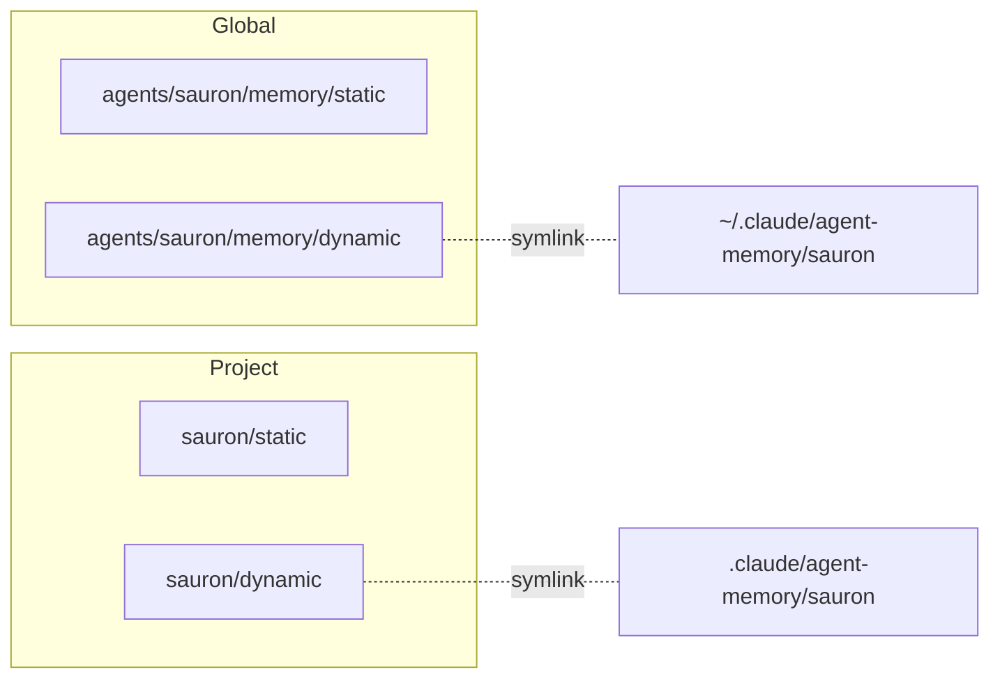
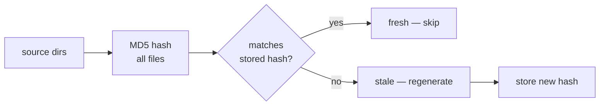

# 2D Memory

How agents store and discover knowledge.

## Shared Memory

Common rules and the consultation directory, injected into every agent's memory at spawn:

```
agents/shared/
├── MEMORY.md                    # rules, conventions, consultation directory
└── memory/dynamic/              # consultation cache files
```

## Per-Agent Memory

Each agent's own knowledge is organized on two axes — **scope** and **mutability**:

| | Static (pre-defined structure) | Dynamic (free-form) |
|---|---|---|
| **Global** | `agents/<agent>/memory/static/` | `agents/<agent>/memory/dynamic/` |
| **Project** | `<project>/<agent>/static/` | `<project>/<agent>/dynamic/` |

**Static** holds content with pre-defined structure — pattern definitions, infrastructure docs, dashboard schemas. Committed and reviewed.

**Dynamic** holds free-form agent notes — operational findings, session state, consultation caches. Auto-managed by agents.

The linking layer maps dynamic dirs into the runtime's expected paths:



=== "Global"

    ```
    agents/<agent>/
    ├── AGENT.md              # role, commands, rules
    ├── instructions/         # procedures (workflow, auth, tools)
    ├── memory/
    │   ├── static/           # pre-defined structure
    │   └── dynamic/          # free-form (auto-generated MEMORY.md, notes)
    └── commands/             # slash command definitions
    ```

=== "Project"

    ```
    <project>/<agent>/
    ├── static/               # pre-defined structure (manifests, dashboards)
    └── dynamic/              # free-form (operational notes, findings)
    ```

??? abstract "How memory is assembled at spawn"

    `agent-memory.sh` combines shared + per-agent into a single `MEMORY.md`:

    ```mermaid
    flowchart TD
        SP[agent spawn] --> HC{sources changed?}
        HC -->|no| SK[skip — cached MEMORY.md is fresh]
        HC -->|yes| GEN[regenerate MEMORY.md]
        GEN --> ST[store new hash]
        ST --> SK
    ```

    | Source | How it's included |
    |--------|------------------|
    | `shared/MEMORY.md` | Always inlined — shared rules for all agents |
    | `instructions/*.md` | Always inlined — agent-specific procedures |
    | `memory/static/*.md` | Inlined if ≤500 lines, indexed if larger |
    | Previous `## Notes` | Preserved — Claude's auto-managed section |

## Cache System

The `lib/cache.sh` library provides hash-based invalidation — used by memory regeneration, consultation, and doc audit to detect when source files have changed.



| Function | Purpose |
|----------|---------|
| `cache_hash <dirs...>` | Compute MD5 of all files in given directories |
| `cache_check <hash_file> <dirs...>` | Returns 0 if fresh, 1 if stale |
| `cache_store <hash_file> <dirs...>` | Store current hash |
| `cache_invalidate <hash_file>` | Remove hash to force regeneration |
