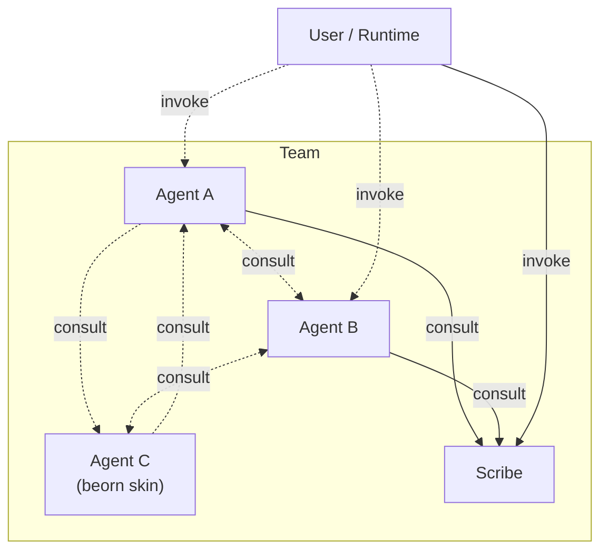

# Overview

## What Kordinate Adds

- **[Guards](guards.md)** — hook-based enforcement that only the right agent performs protected operations
- **[Kords](kords.md)** — defined protocols between agents for sharing expertise
- **[Subagent P2P](../agents/beorn.md)** — subagents can invoke other subagents at any depth
- **[Recall System](memory.md)** — knowledge properties and registry on top of the runtime's native memory

The user's runtime (Claude Code, Codex, Cursor) invokes agents. Current runtimes don't allow subagents to spawn other subagents. Kordinate removes this limitation — any subagent, at any depth, can [invoke another agent](../agents/beorn.md).

Agents define what they provide to each other through **[kords](kords.md)** — protocols that specify the topic, format, and guidelines for each consultation. A pair of agents can have multiple kords for different topics (shown as separate arrows above).

See the [Default Team](../agents/index.md) for agent structure and roster.
