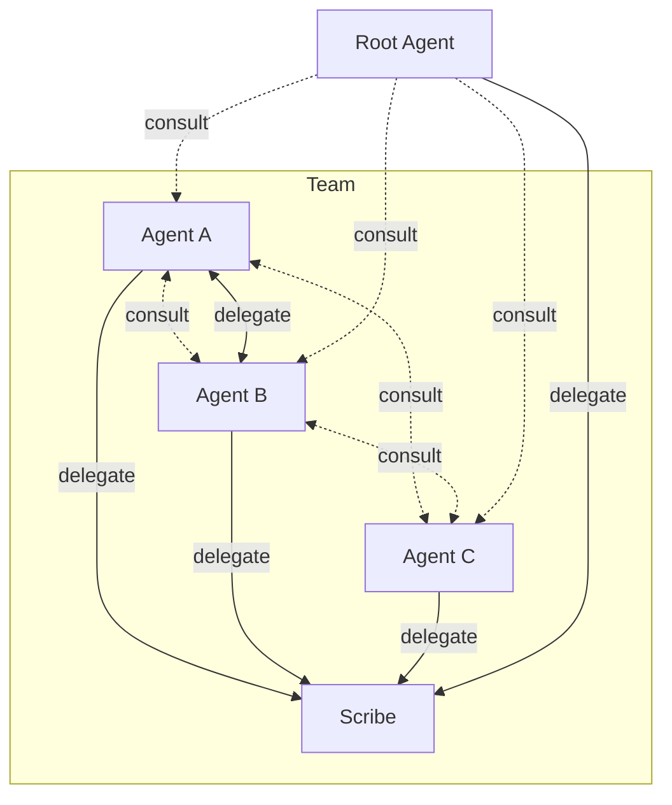

# Overview



**[Root](#root)** is the user's existing agent (Claude, Codex, Cursor).

**[Scribe](#scribe)** ships with the framework — it guards all `.md` edits and handles onboarding new agents. Always part of the team.

Kordinate adds:

- **[Recall System](memory.md)** — structured knowledge (static/dynamic × global/project) with caching and refresh
- **[Guards](guards.md)** — hook-based enforcement that only the right agent performs protected operations
- **[Kords](kords.md)** — defined protocols between agents for sharing expertise

## Agent Structure

Every agent follows the same layout. Use `/scribe:onboard` to add new agents to the team.

```
agents/<name>/
├── IDENTITY.md              # role, triggers, commands, rules
├── memory/
│   ├── static/              # curated domain knowledge
│   └── dynamic/             # auto-managed (consultations, operational notes)
└── commands/                # slash command definitions
```

## Core Agents

### Root

The orchestrator. Root's `IDENTITY.md` defines the team — all subagents inherit its rules, commands, and hooks. Mapped to the runtime's main agent (e.g. Claude Code's `CLAUDE.md`) via the [linking layer](../reference/linking.md).

All inherited by subagents:

**Commands** — `/boot` (init workstation), `/consult` (query agent), `/merge` (merge session branch).

**Guards** — `guard-git.sh` (branch protection), `guard-md.sh` (scribe-only `.md` edits). See [Guards](guards.md).

**Hooks** — `auto-merge-to-dev.sh` (post-push PR + fast-forward), `agent-memory.sh` (pre-spawn memory refresh).

### Scribe

Documentation gate — present in every team. Only agent authorized to edit `.md` files. All other agents delegate markdown edits to scribe.

Protected by `guard-md.sh` — see [Guards](guards.md).

**Commands** — `/scribe:onboard` (add agent), `/scribe:kord` (define kord), `/scribe:update-agent-docs`, `/scribe:update-project-docs`.
