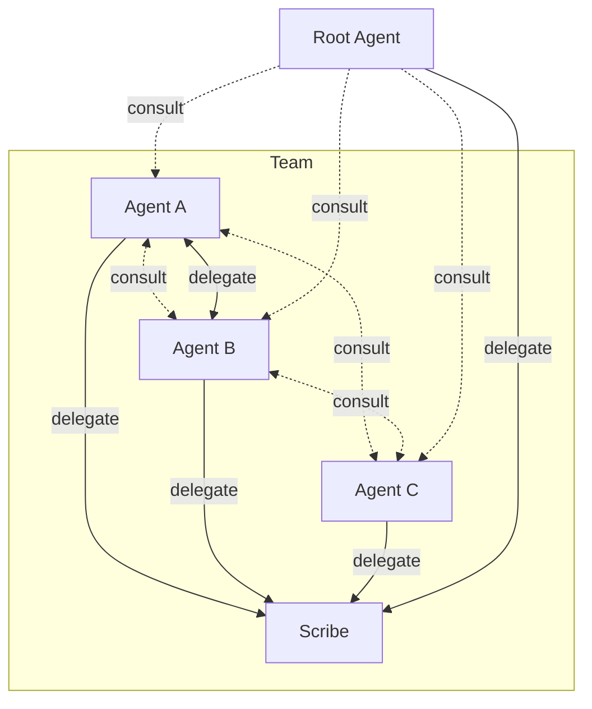

# Overview

**[Root](root.md)** is the user's existing agent (Claude, Codex, Cursor).

**[Scribe](scribe.md)** ships with the framework — it guards all `.md` edits and handles [onboarding new agents](scribe.md#onboarding-an-agent). Always part of the team.

Kordinate adds:

- **[Recall System](memory.md)** — structured knowledge (static/dynamic × global/project) with caching and refresh
- **[Guards](guards.md)** — hook-based enforcement that only the right agent performs protected operations
- **[Kords](kords.md)** — defined protocols between agents for sharing expertise

## Agent Structure

Every agent follows the same layout: `IDENTITY.md` defines identity, `memory/` holds knowledge, `commands/` holds slash commands. See [Onboarding an Agent](scribe.md#onboarding-an-agent) for the full structure and how new agents are created.
