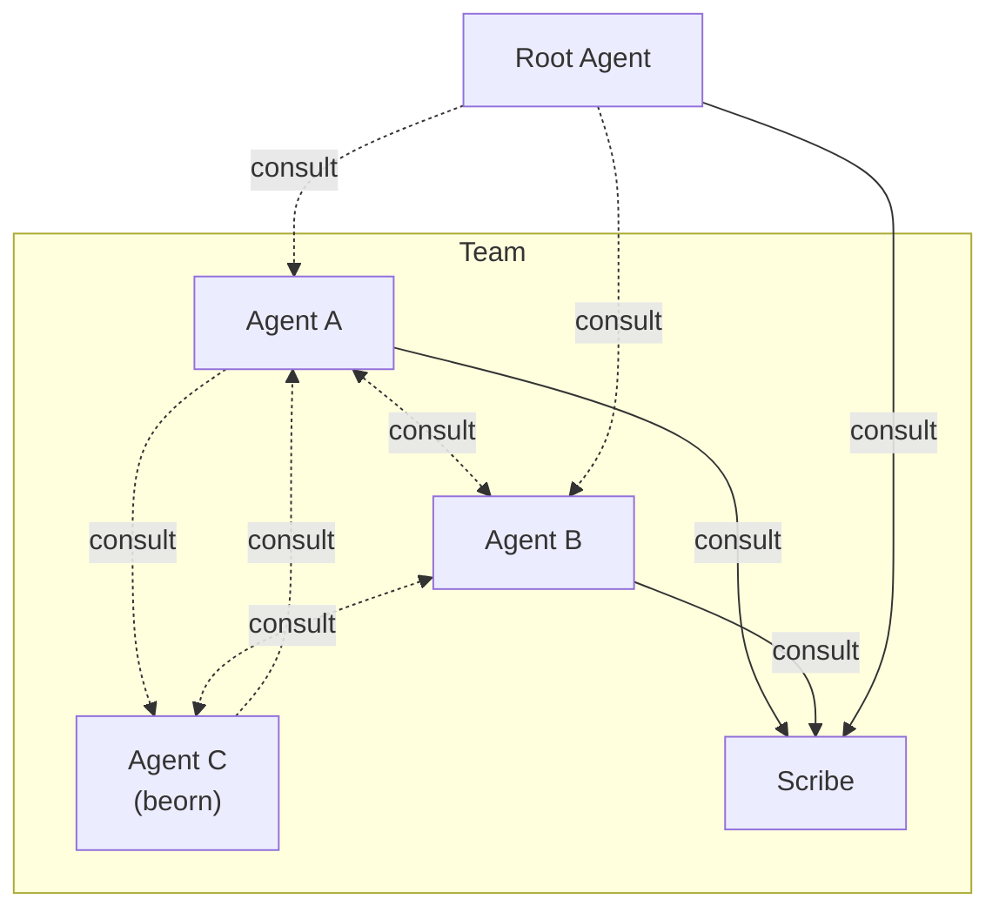

# Overview



## What Kordinate Adds

**[Root](#root)** is the user's existing agent (Claude, Codex, Cursor). **[Scribe](#scribe)** ships with the framework — it guards all `.md` edits and handles onboarding new agents. Always part of the team.

**[Beorn](#beorn)** is the transport layer — a shape-shifting server that any agent calls to reach any other agent via `/consult`. Beorn loads the target agent's identity, invokes it, and returns the response.

Agents consult each other through **[kords](kords.md)** — defined protocols that specify what one agent provides to another. A single pair of agents can have multiple kords for different topics (shown as separate arrows in the diagram). All consultations flow through beorn.

- **[Recall System](memory.md)** — structured knowledge (static/dynamic × global/project) with caching and refresh
- **[Guards](guards.md)** — hook-based enforcement that only the right agent performs protected operations
- **[Kords](kords.md)** — defined protocols between agents for sharing expertise
- **[Beorn](beorn.md)** — MCP agent server for inter-agent communication

## Agent Structure

Every agent follows the same layout. Use `/scribe:onboard` to add new agents to the team.

```
agents/<name>/
├── IDENTITY.md              # role, triggers, commands, rules
├── memory/
│   ├── static/              # curated domain knowledge
│   └── dynamic/             # auto-managed (consultations, operational notes)
└── commands/                # slash command definitions
```

## Core Agents

### Root

The orchestrator. Root's `IDENTITY.md` defines the team — all subagents inherit its rules, commands, and hooks. Mapped to the runtime's main agent (e.g. Claude Code's `CLAUDE.md`) via the [linking layer](../dev/linking.md).

All inherited by subagents:

**Commands** — `/boot` (catch up on context), `/consult` (query or delegate to an agent), `/merge` (merge session branch).

**Guards** — `guard-git.sh` (branch protection), `guard-md.sh` (scribe-only `.md` edits). See [Guards](guards.md).

**Hooks** — `auto-merge-to-dev.sh` (post-push PR + fast-forward), `agent-memory.sh` (pre-spawn memory refresh).

### Scribe

Documentation gate — present in every team. Only agent authorized to edit `.md` files. All other agents delegate markdown edits to scribe.

Protected by `guard-md.sh` — see [Guards](guards.md).

**Commands** — `/scribe:onboard` (add agent), `/scribe:kord` (define kord), `/scribe:update-agent-docs`, `/scribe:update-project-docs`.

### Beorn

Shape-shifting MCP agent server. Always-on service that any agent can call to reach any other agent. Beorn loads the target agent's identity and memory, invokes Claude Code as that agent, and returns the response.

**Tools** — `mcp__beorn__delegate` (invoke an agent), `mcp__beorn__status` (server health).

`/consult` uses beorn as its transport layer. See [Beorn](beorn.md) for architecture details.
