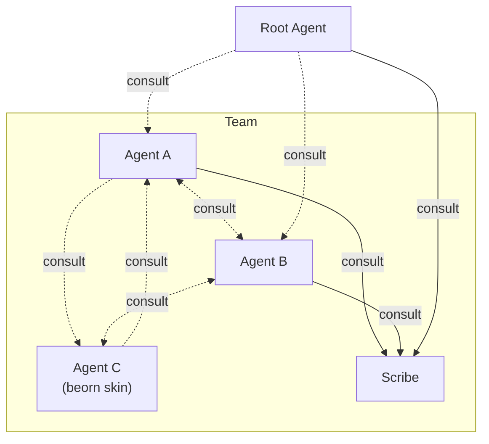

# Overview



## What Kordinate Adds

- **[Recall System](memory.md)** — structured knowledge (static/dynamic × global/project) with caching and refresh
- **[Guards](guards.md)** — hook-based enforcement that only the right agent performs protected operations
- **[Kords](kords.md)** — defined protocols between agents for sharing expertise
- **[Subagent P2P](beorn.md)** — subagents can invoke other subagents at any depth

**[Root](#root)** is the user's existing agent — Claude Code, Codex, Cursor, or any compatible runtime. It orchestrates a team of subagents, each with its own identity, memory, and commands.

Current agent runtimes don't allow subagents to spawn other subagents. Kordinate removes this limitation by introducing [beorn](beorn.md) — any subagent, at any depth, can invoke another agent.

A **beorn** is a short-lived agent clone spawned on demand. It assumes a **skin** — the target agent's identity and memory — handles the request, and exits. The [beorn server](beorn.md) is the MCP factory that manages this lifecycle.

Agents define what they provide to each other through **[kords](kords.md)** — protocols that specify the topic, format, and guidelines for each consultation. A pair of agents can have multiple kords for different topics (shown as separate arrows above).

## Agent Structure

Every agent follows the same layout. Use `/scribe:onboard` to add new agents to the team.

```
agents/<name>/
├── IDENTITY.md              # role, triggers, commands, rules
├── memory/
│   ├── static/              # curated domain knowledge
│   └── dynamic/             # auto-managed (consultations, operational notes)
└── commands/                # slash command definitions
```

## Core Agents

### Root

The orchestrator. Root's `IDENTITY.md` defines the team — all subagents inherit its rules, commands, and hooks. Root is mapped to the runtime's main agent (e.g. Claude Code's `CLAUDE.md`) via the [linking layer](../dev/linking.md).

### Scribe

Documentation gate. Only agent authorized to edit `.md` files — all other agents delegate markdown edits to scribe.

### Beorn

A beorn is a short-lived agent clone. It assumes a **skin** — another agent's identity and memories. When a subagent invokes another, the beorn server creates a beorn with the target subagent's skin, handles the request, and returns the result.

`/consult` uses the beorn server as its transport layer. See [Subagent P2P](beorn.md) for architecture details.

---

For a full listing of commands, guards, hooks, and tools across all agents, see the [Agent Reference](../reference/agents.md).
