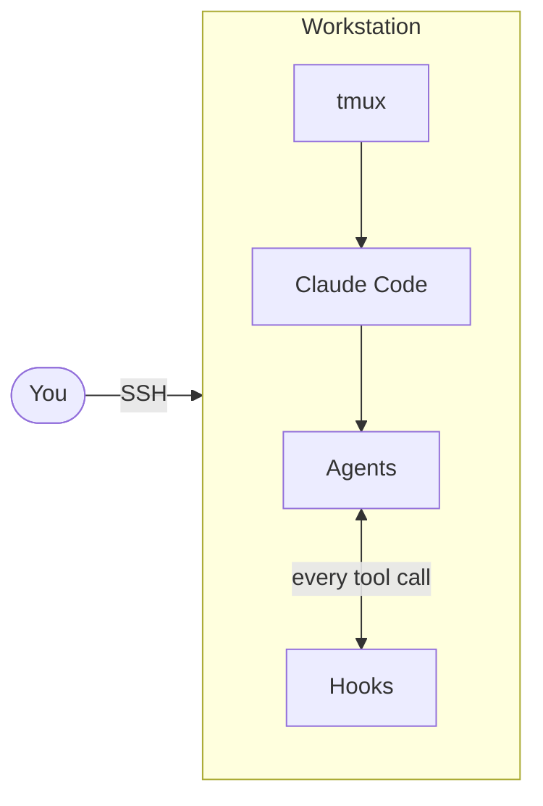
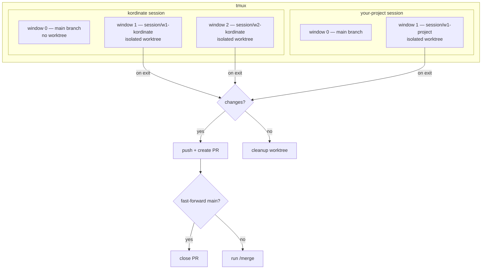

# Workflow

How you interact with kordinate day-to-day.

## Overview

Each tmux window runs its own Claude Code instance with isolated agents and hooks.

## Worktree Sessions

Each window creates an isolated git worktree + branch via `bin/claude-session`. On exit: push + PR if changes, cleanup if not.

## Branch Model

`session/*` → `main` → `test` → `prod`

The `auto-merge-to-dev.sh` hook tries to fast-forward main after each push to a session branch. If it fails (conflicts), run `/merge`.
