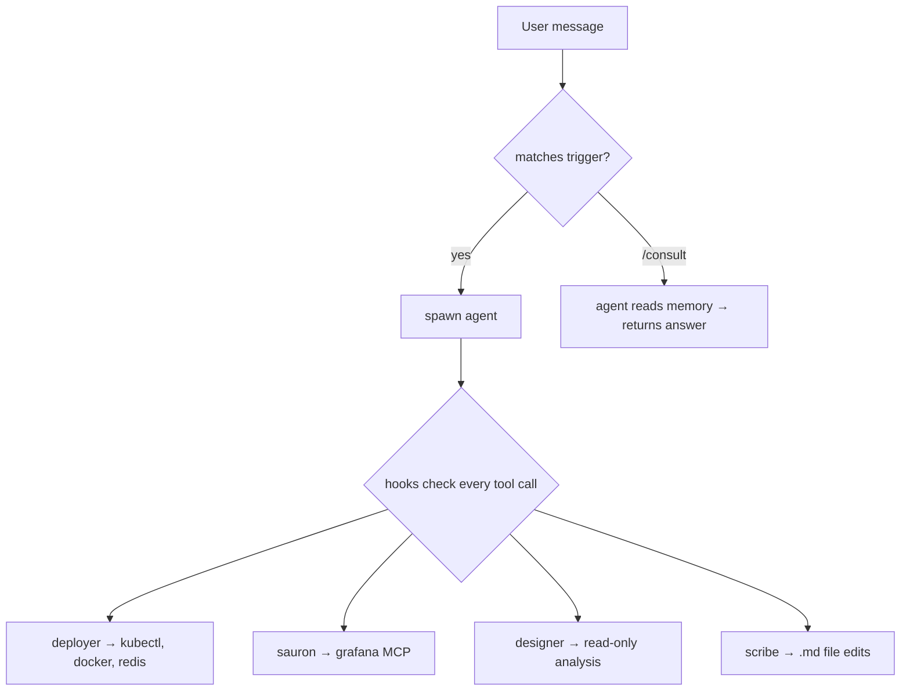
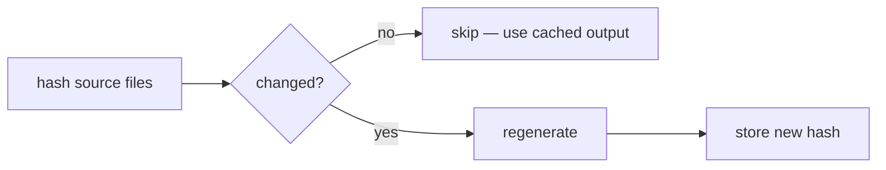

# Hooks

Hooks fire on every tool call. They enforce safety and automate housekeeping. Registered in `settings.json`.

## How Requests Flow

## Guards

Each guard enforces that only the authorized agent can perform certain operations.

### Authentication flow

1. Agent copies `profile/locks/<agent>` → `/tmp/.<agent>-auth`
2. Hook reads both files, allows if they match
3. Agent removes `/tmp/.<agent>-auth` after completing work

### Guard table

| Hook | Agent | What it guards |
|------|-------|---------------|
| `guard-kubectl.sh` | deployer | kubectl writes via SSH. Master namespace needs bootstrap auth. |
| `guard-git.sh` | deployer | git push to test/prod branches |
| `guard-redis.sh` | deployer | Redis MCP access |
| `guard-grafana.sh` | sauron | Grafana MCP and dashboard JSON edits |
| `guard-md.sh` | scribe | All `.md` file edits |

## Automation

| Hook | When | What it does |
|------|------|-------------|
| `auto-merge-to-dev.sh` | After git push | Fast-forwards main if a session branch was pushed |
| `agent-memory.sh` | Before agent spawn | Regenerates agent's MEMORY.md if source files changed |

## Cache Library

Both `agent-memory.sh` and the consultation cache use the shared `lib/cache.sh` library for hash-based invalidation:

??? info "Functions in `lib/cache.sh`"

    | Function | Purpose |
    |----------|---------|
    | `cache_hash <dirs...>` | Compute hash of all files in given directories |
    | `cache_check <hash_file> <dirs...>` | Returns 0 if fresh, 1 if stale |
    | `cache_store <hash_file> <dirs...>` | Store current hash |
    | `cache_invalidate <hash_file>` | Remove hash to force regeneration |
