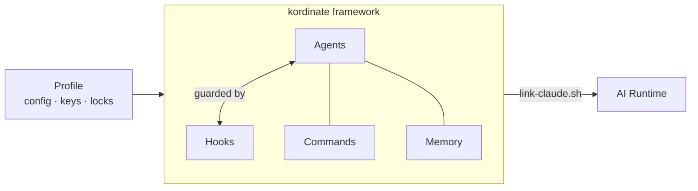

# Kordinate

Multi-cluster k8s infrastructure managed by specialized agents.

## Architecture



| Component | Role |
|-----------|------|
| **Agents** | Do the work — each has a role, commands, and memory. Spawned on trigger words. |
| **Hooks** | Enforce safety — every tool call passes through guards. |
| **Memory** | What agents know — static (curated), dynamic (auto-managed), project-specific. |
| **Profile** | Site-specific config — cluster IPs, credentials, MCP servers. Encrypted. |
| **Linking** | Maps kordinate to the AI runtime (currently Claude Code). Agent-agnostic. |

??? abstract "Getting Started"

    === "New installation"

        ```bash
        git clone <repo-url> ~/kordinate
        cd ~/kordinate
        ./installer/link-claude.sh              # link framework into ~/.claude/
        ./installer/kordinate-cli init   # bootstrap k8s + workstation
        ```

    === "Joining existing cluster"

        ```bash
        git clone <repo-url> ~/kordinate
        cd ~/kordinate
        git-crypt unlock                 # decrypt profile/
        ./installer/link-claude.sh
        ./installer/kordinate-cli hydrate
        ```

    ??? note "Profile layout"

        ```
        profile/
        ├── config.yaml             # Cluster IPs, ports, services, registry
        ├── topology.yaml           # App definitions, monitoring, health thresholds
        ├── mcp.json                # MCP server config
        ├── keybindings.json        # Keyboard shortcuts
        ├── locks/                  # Agent auth locks (deployer, sauron, scribe)
        ├── keystore/               # Symlink → ~/.password-store/kordinate/
        ├── additions/              # Extra k8s manifests applied to clusters
        └── overlays/               # Kustomize overlays per cluster/environment
        ```

    ??? note "config.yaml reference"

        ```yaml
        clusters:
          mycluster:
            name: mycluster
            tailscale_ip: 100.x.x.x
            lan_network: 10.0.0.0/24
            gateway_lan_ip: 10.0.0.1
            nodes: [10.0.0.1, 10.0.0.2]
            namespaces: [dev, test, prod, monitor]
            manifests:
              master: agents/deployer/manifests/master
              monitor: agents/deployer/manifests/monitor
              bootstrap: agents/deployer/manifests/bootstrap
              platform: profile/additions
            services:
              postgres: { port: 30632, user: myuser, database: mydb }
              redis: { port: 30379 }
              metrics: { port: 30091 }
              grafana: { port: 30300, namespace: master }
              registry: { port: 5000, host: 10.0.0.1 }

        network:
          tailnet: tailXXXXXX.ts.net
          grafana_public: grafana.example.com
        ```

    ??? note "topology.yaml reference"

        ```yaml
        apps:
          your-app:
            label: your-app
            namespaces: [dev, test, prod]
            consumers:
              component-a: { port: 9100 }

        monitoring:
          retention:
            gateway: 3h
            master: 30d

        health:
          sentinel:
            port: 9131
            interval: 30s

        logging:
          suppress: [kafka, urllib3]
          format: json
        ```

## Explore

<div class="grid cards" markdown>

-   **[Infrastructure](infrastructure.md)**

    Client→workstation flow, worktree sessions, cluster architecture, observability.

-   **[Agents](agents.md)**

    Who does what, shared rules, per-agent specifics, and commands.

-   **[Hooks](hooks.md)**

    Safety guards, automation, request flow, and the shared cache library.

-   **[Consultation](consultation.md)**

    Cross-agent queries, the consultation matrix, and result caching.

-   **[Memory](memory.md)**

    How agents store and discover knowledge — static, dynamic, and project layers.

-   **[Reference](reference/patterns/index.md)**

    Design patterns, shared libraries, and link mapping.

</div>
