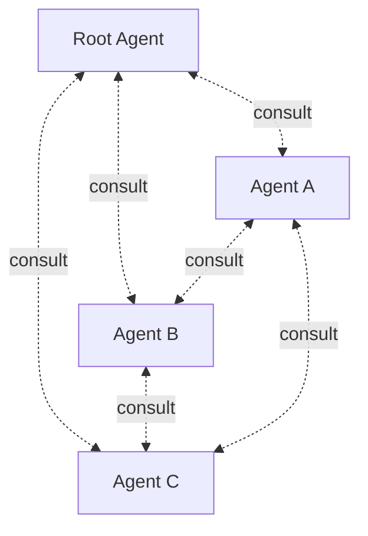

# Kordinate

A framework for kording specialized agents into a team.

Agents are wired into a team: they share a [consultation protocol](framework/consultation.md) and a [2D memory model](framework/memory.md), but each has exclusive authority over its own tools and resources.

[Hooks](framework/agents.md#root) enforce boundaries — agents cannot step outside their domain.

Teams are composed by defining agents and connecting them through consultation matrices and hook guards. Run `/scribe:kord` to add your own.

## Explore

-   **[Framework](framework/agents.md)**

    The agent protocol -- roles, commands, memory model, hooks, and consultation.

-   **[Example: Infra Team](infra/infrastructure.md)**

    Deployer, sauron, and designer managing multi-cluster k8s infrastructure.

-   **[Kord your own](guides/how-to-kord.md)**

    Add a new agent with `/scribe:kord` — or see how designer was built.

-   **[Resources](reference/index.md)**

    Design patterns, shared libraries, and source mapping.

