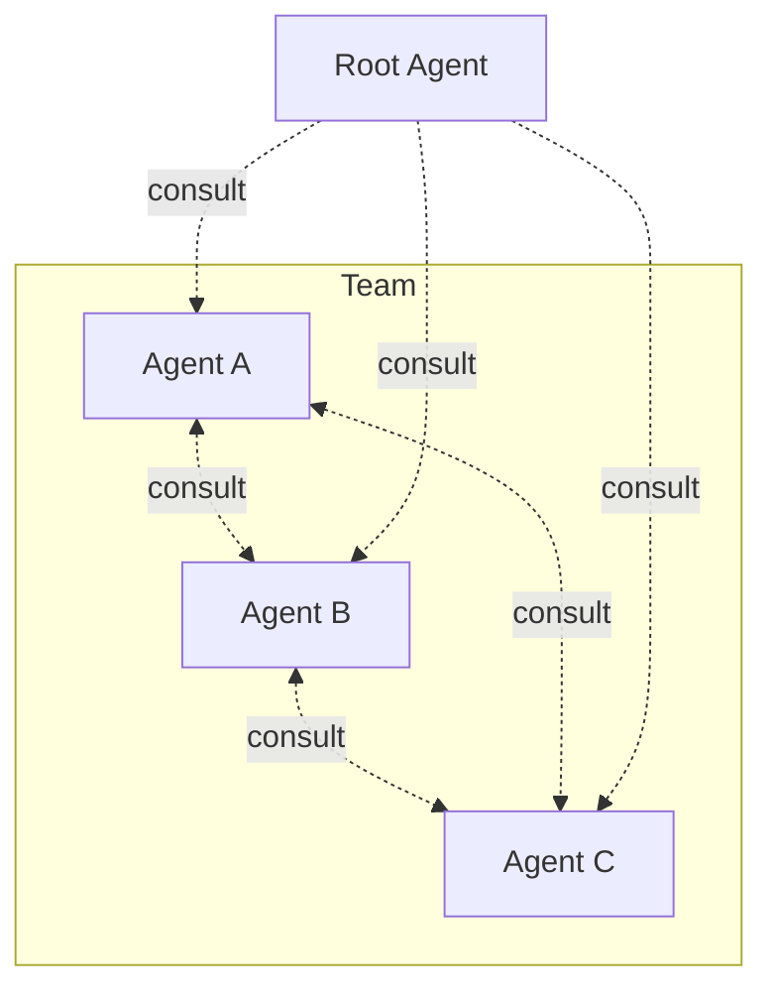

# Kordinate

A framework for kording specialized agents into a team. Each agent owns a domain with exclusive tools, shares a [consultation protocol](framework/consultation.md) and [2D memory](framework/memory.md) with the team, and is kept in its lane by [hooks](framework/root.md). Run `/scribe:kord` to add your own.

## Explore

-   **[Root Agent](framework/root.md)**

    The orchestrator — routing, hooks, and team rules.

-   **[Scribe](framework/scribe.md)**

    Documentation gate + `/scribe:kord` to add new agents.

-   **[2D Memory](framework/memory.md)**

    How agents store and discover knowledge.

-   **[Example: Infra Team](infra/infrastructure.md)**

    Deployer + Sauron managing multi-cluster k8s.

