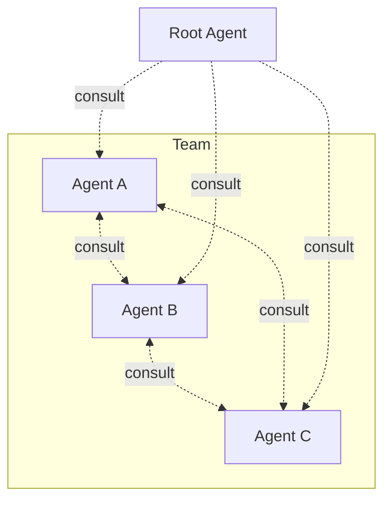

# Kordinate

A framework for kording specialized agents into a team. Each agent owns a domain with exclusive tools, shares a [consultation protocol](framework/consultation.md) and [2D memory](framework/memory.md) with the team, and is kept in its lane by [hooks](framework/root.md). Run `/scribe:kord` to add your own.

## Explore

-   **[Framework](framework/root.md)**

    Core agents, memory model, consultation, and the infra team example.

-   **[Kord your own](framework/scribe.md#kording-an-agent)**

    Add a new agent with `/scribe:kord` — see how designer was built.

-   **[Resources](reference/index.md)**

    Design patterns, shared libraries, and source mapping.

