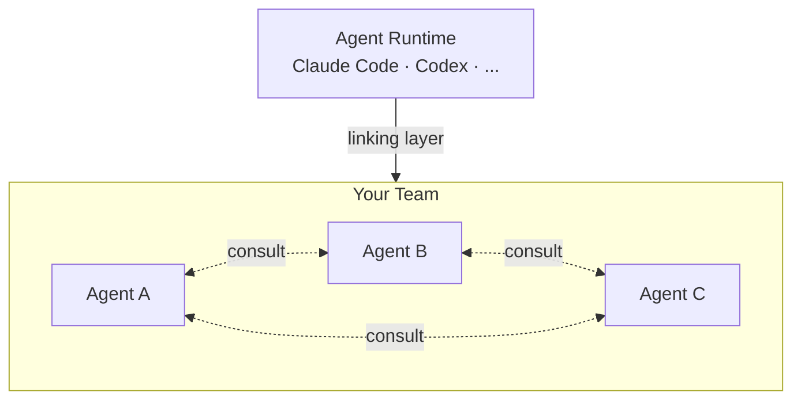

# Kordinate

A framework for kording specialized agents into a team.

Kordinate gives each agent a role, memory, commands, and safety hooks -- then links them into an AI runtime so they can work together. You define the agents; kordinate handles the coordination.



Each agent is a specialized subagent with its own role, memory, tools, and permissions. Agents are **kord'd into a team** — they share common rules, a consultation protocol, and a memory model, but each has exclusive authority over its own domain. The framework enforces boundaries via [hooks](framework/hooks.md) so agents cannot step outside their role.

The **scribe** agent is part of the core framework — it manages all `.md` file edits and is present in every team. All other agents are team-specific. See the [Kording Guide](kording-guide.md) to add your own.

## Quick Start

=== "New installation"

    ```bash
    git clone <repo-url> ~/kordinate
    cd ~/kordinate
    ./installer/link-claude.sh              # link framework into ~/.claude/
    ./installer/kordinate-cli init           # bootstrap k8s + workstation
    ```

=== "Joining existing cluster"

    ```bash
    git clone <repo-url> ~/kordinate
    cd ~/kordinate
    git-crypt unlock                         # decrypt profile/
    ./installer/link-claude.sh
    ./installer/kordinate-cli hydrate
    ```

??? note "Profile layout"

    ```
    profile/
    ├── config.yaml             # Cluster IPs, ports, services, registry
    ├── topology.yaml           # App definitions, monitoring, health thresholds
    ├── mcp.json                # MCP server config
    ├── keybindings.json        # Keyboard shortcuts
    ├── locks/                  # Agent auth locks (deployer, sauron, scribe)
    ├── keystore/               # Symlink → ~/.password-store/kordinate/
    ├── additions/              # Extra k8s manifests applied to clusters
    └── overlays/               # Kustomize overlays per cluster/environment
    ```

??? note "config.yaml reference"

    ```yaml
    clusters:
      mycluster:
        name: mycluster
        tailscale_ip: 100.x.x.x
        lan_network: 10.0.0.0/24
        gateway_lan_ip: 10.0.0.1
        nodes: [10.0.0.1, 10.0.0.2]
        namespaces: [dev, test, prod, monitor]
        manifests:
          master: agents/deployer/manifests/master
          monitor: agents/deployer/manifests/monitor
          bootstrap: agents/deployer/manifests/bootstrap
          platform: profile/additions
        services:
          postgres: { port: 30632, user: myuser, database: mydb }
          redis: { port: 30379 }
          metrics: { port: 30091 }
          grafana: { port: 30300, namespace: master }
          registry: { port: 5000, host: 10.0.0.1 }

    network:
      tailnet: tailXXXXXX.ts.net
      grafana_public: grafana.example.com
    ```

??? note "topology.yaml reference"

    ```yaml
    apps:
      your-app:
        label: your-app
        namespaces: [dev, test, prod]
        consumers:
          component-a: { port: 9100 }

    monitoring:
      retention:
        gateway: 3h
        master: 30d

    health:
      vitals:
        port: 9131
        interval: 30s

    logging:
      suppress: [kafka, urllib3]
      format: json
    ```

## Explore

<div class="grid cards" markdown>

-   **[Framework](framework/agents.md)**

    The agent protocol -- roles, commands, memory model, hooks, and consultation.

-   **[Example: Infra Team](infra/infrastructure.md)**

    The deployer + sauron agents managing multi-cluster k8s infrastructure.

-   **[Kording Guide](kording-guide.md)**

    Step-by-step: how to add a new specialized agent to your team.

-   **[Reference](reference/patterns/index.md)**

    Design patterns, shared libraries, observability contract, and link mapping.

</div>
