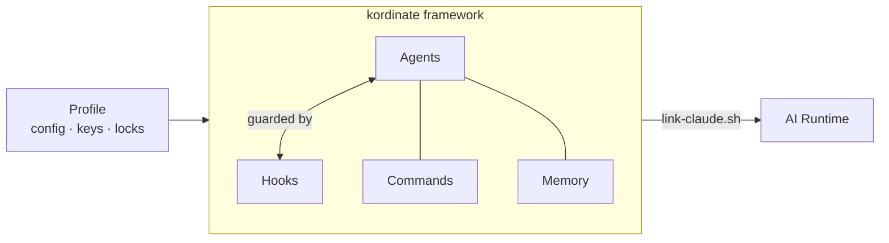

# Kordinate

A framework for kording specialized agents into a team.

Kordinate gives each agent a role, memory, commands, and safety hooks -- then links them into an AI runtime so they can work together. You define the agents; kordinate handles the coordination.

## The Protocol



| Component | Role |
|-----------|------|
| **Agents** | Do the work -- each has a role, triggers, commands, and memory. Spawned on trigger words. |
| **Memory** | What agents know -- static (curated), dynamic (auto-managed), project-specific. |
| **Consultation** | Cross-agent queries -- agents ask each other for expertise they lack. Cached and hash-invalidated. |
| **Hooks** | Enforce safety -- every tool call passes through guards. Only the owning agent can use protected resources. |
| **Linking** | Maps kordinate to the AI runtime (currently Claude Code). Agent-agnostic. |
| **Profile** | Site-specific config -- cluster IPs, credentials, MCP servers. Encrypted with git-crypt. |

## The Team

Kordinate ships with an infrastructure team as a working example -- two operational agents (deployer + sauron), an architecture reviewer (designer), and a documentation gate (scribe):

| Agent | What it does | Exclusive access |
|-------|-------------|-----------------|
| **deployer** | Rolls deployments, manages clusters, bootstraps infrastructure | kubectl writes, Redis |
| **sauron** | Adds monitoring, validates code, manages dashboards | Grafana |
| **designer** | Reviews architecture, owns design patterns | -- |
| **scribe** | Sole editor of `.md` files | all `.md` edits |

These agents consult each other automatically -- the deployer asks sauron about monitoring impact before rolling, sauron asks the deployer about cluster state before diagnosing, and the designer grounds architecture reviews in live infrastructure reality.

## Quick Start

=== "New installation"

    ```bash
    git clone <repo-url> ~/kordinate
    cd ~/kordinate
    ./installer/link-claude.sh              # link framework into ~/.claude/
    ./installer/kordinate-cli init           # bootstrap k8s + workstation
    ```

=== "Joining existing cluster"

    ```bash
    git clone <repo-url> ~/kordinate
    cd ~/kordinate
    git-crypt unlock                         # decrypt profile/
    ./installer/link-claude.sh
    ./installer/kordinate-cli hydrate
    ```

??? note "Profile layout"

    ```
    profile/
    ├── config.yaml             # Cluster IPs, ports, services, registry
    ├── topology.yaml           # App definitions, monitoring, health thresholds
    ├── mcp.json                # MCP server config
    ├── keybindings.json        # Keyboard shortcuts
    ├── locks/                  # Agent auth locks (deployer, sauron, scribe)
    ├── keystore/               # Symlink → ~/.password-store/kordinate/
    ├── additions/              # Extra k8s manifests applied to clusters
    └── overlays/               # Kustomize overlays per cluster/environment
    ```

??? note "config.yaml reference"

    ```yaml
    clusters:
      mycluster:
        name: mycluster
        tailscale_ip: 100.x.x.x
        lan_network: 10.0.0.0/24
        gateway_lan_ip: 10.0.0.1
        nodes: [10.0.0.1, 10.0.0.2]
        namespaces: [dev, test, prod, monitor]
        manifests:
          master: agents/deployer/manifests/master
          monitor: agents/deployer/manifests/monitor
          bootstrap: agents/deployer/manifests/bootstrap
          platform: profile/additions
        services:
          postgres: { port: 30632, user: myuser, database: mydb }
          redis: { port: 30379 }
          metrics: { port: 30091 }
          grafana: { port: 30300, namespace: master }
          registry: { port: 5000, host: 10.0.0.1 }

    network:
      tailnet: tailXXXXXX.ts.net
      grafana_public: grafana.example.com
    ```

??? note "topology.yaml reference"

    ```yaml
    apps:
      your-app:
        label: your-app
        namespaces: [dev, test, prod]
        consumers:
          component-a: { port: 9100 }

    monitoring:
      retention:
        gateway: 3h
        master: 30d

    health:
      vitals:
        port: 9131
        interval: 30s

    logging:
      suppress: [kafka, urllib3]
      format: json
    ```

## Explore

<div class="grid cards" markdown>

-   **[Framework](framework/agents.md)**

    The agent protocol -- roles, commands, memory model, hooks, and consultation.

-   **[Example: Infra Team](infra/infrastructure.md)**

    The deployer + sauron agents managing multi-cluster k8s infrastructure.

-   **[Kording Guide](kording-guide.md)**

    Step-by-step: how to add a new specialized agent to your team.

-   **[Reference](reference/patterns/index.md)**

    Design patterns, shared libraries, observability contract, and link mapping.

</div>
