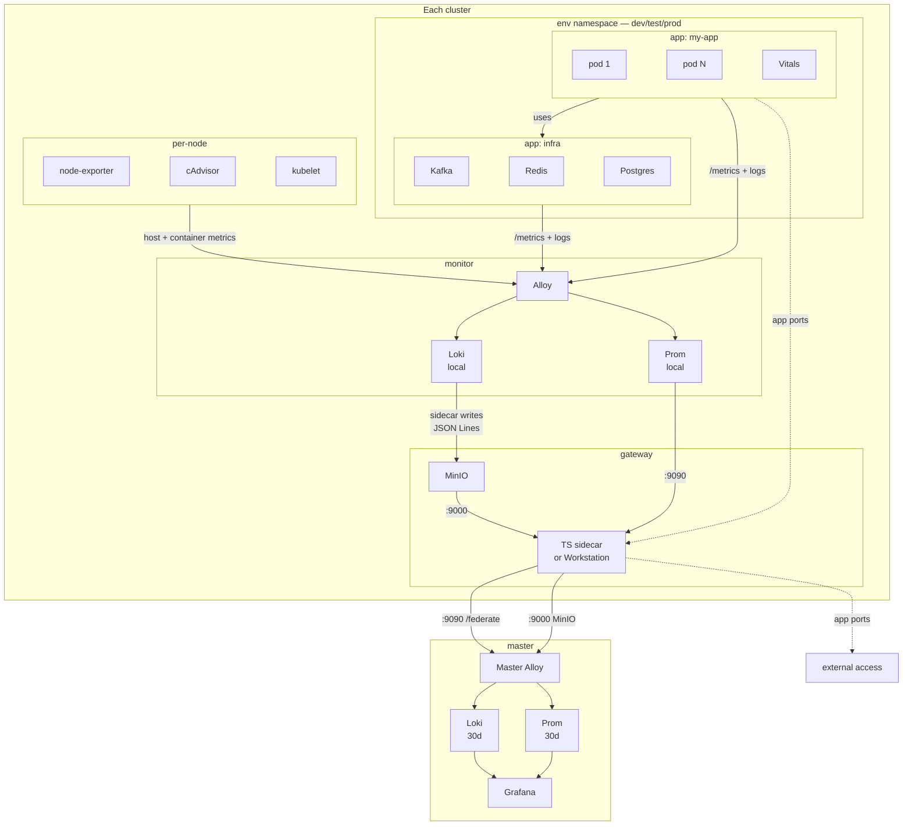

# Deployer

How the system is deployed, accessed, and observed -- plus the deployer agent that manages it all.

## Deployer

The deployer agent owns all infrastructure operations. It is the only agent authorized to write to clusters.

| | |
|---|---|
| **Triggers** | `roll`, `roll forward`, `roll backward`, `publish`, `migrate` |
| **Authority** | kubectl writes, container registry, Redis |
| **Exclusive Tools** | postgres.py, Redis MCP |
| **Style** | Reactive -- executes on request |

### Commands

| Command | Description |
|---------|-------------|
| `/deployer:roll` | Roll between environments |
| `/deployer:stop` | Scale down an environment |
| `/deployer:clean` | Clean up environment data |
| `/deployer:diff` | Stage incremental data changes |
| `/deployer:bootstrap` | Bootstrap cluster infrastructure |

### Memory

| | Static | Dynamic |
|---|---|---|
| **Global** | infra.md, migration.md, troubleshooting.md | auto-managed |
| **Project** | `deployer/static/` -- k8s manifests | `deployer/dynamic/` -- operational notes |

### Hooks

Two guard hooks enforce deployer-only access to dangerous operations:

| Hook | What it guards |
|------|---------------|
| `guard-kubectl.sh` | kubectl writes via SSH (`apply`, `delete`, `scale`, `rollout`, etc.) + `docker build/push/tag`. Hard-blocks workstation resources and master namespace writes without bootstrap auth. |
| `guard-redis.sh` | Redis MCP access -- only deployer may use Redis tools. |

Both hooks use the profile lock authentication flow: the deployer copies `profile/locks/deployer` to `/tmp/.deployer-auth`, the hook compares the files, and the deployer removes the temp file when done.

---

??? abstract "Cluster architecture"

    Each k3s cluster is standalone with its own control plane, worker nodes, and observability stack. Clusters connect over Tailscale but operate independently.

    App namespaces (`dev`, `test`, `prod`) run workloads only. Each cluster has three infrastructure namespaces:

    | Namespace | What runs there |
    |-----------|----------------|
    | `gateway` | Gateway Tailscale (cluster's external interface) + Workstation (if interactive cluster) |
    | `monitor` | Alloy, Prom (local), Loki (local), KSM, node-exporter |
    | `master` | Master Alloy, Prom (30d), Loki (30d), Grafana -- one cluster only |

    ```mermaid
    flowchart TB
        subgraph CA[cluster-a]
            A1[dev apps] & A2[test apps] & A3[prod apps]

            subgraph mon-a[monitor]
                GA[alloy] --> PA[prom + loki<br/>local]
            end

            subgraph gw-a[gateway]
                GWT[tailscale]
                WS[workstation]
            end

            A1 & A2 & A3 -.->|/metrics + stdout| GA
        end

        subgraph M[master]
            MA[master alloy] --> MP[prom<br/>30d] & ML[loki<br/>30d]
            MP & ML --> G[Grafana]
        end

        GWT -->|tailnet| MA

        CB[cluster-b<br/>same structure]

        CB -->|tailnet| MA
    ```

    The `gateway` namespace is the cluster's front door -- either a full workstation (for interactive clusters) or just the Tailscale pod (for headless clusters). Master runs on one cluster but is logically independent.

## Data Flow

All observability is **pull-based**. Apps follow the [observability contract](monitoring.md) -- Gateway Alloy collects everything into local Prom + Loki. Gateway Tailscale federates to master.



**Collection:** Alloy scrapes app pods and infra services (via `prometheus.io/scrape` annotations), node-exporter, cAdvisor, kubelet, and KSM. Tails pod stdout via K8s API. Writes to local Prom + Loki with local retention.

**Federation:** Gateway Tailscale forwards `:9090` (Prom /federate), `:9000` (MinIO), and app ports on the tailnet. Master Alloy pulls metrics via Prom `/federate`. For logs, a puller sidecar on master fetches JSON Lines from each gateway's MinIO bucket via Tailscale `:9000`, writes to local emptyDir, and master Alloy tails the files with `loki.source.file` -- pull-based, master reads at its own pace.

!!! note "Loki federation sidecar"
    Loki does not support pull-based federation natively. A sidecar in the Loki pod queries `localhost:3100` every 60s and writes JSON Lines files to a MinIO bucket in the gateway namespace (1 hour retention, auto-cleaned). Gateway Tailscale exposes MinIO on `:9000`. A puller sidecar on master fetches from each gateway's MinIO via Tailscale `:9000`, writes to a local emptyDir volume, and master Alloy tails the files with `loki.source.file`. Labels are preserved in the JSON Lines format and re-extracted by master Alloy's `loki.process` pipeline.

??? abstract "What Alloy normalizes"

    Alloy drops raw infrastructure metric prefixes and re-exports them under `pipeline_*` so dashboards and vitals use a consistent namespace.

    | Source | Raw metric | Normalized to |
    |--------|-----------|---------------|
    | Kubelet | `kubelet_volume_stats_used_bytes` | `pipeline_pvc_used_bytes` |
    | Kubelet | `kubelet_volume_stats_capacity_bytes` | `pipeline_pvc_capacity_bytes` |
    | KSM | `kube_pod_container_status_restarts_total` | `pipeline_container_restarts_total` |
    | KSM | `kube_cronjob_spec_suspend` | `pipeline_cronjob_suspended` |
    | KSM | `kube_cronjob_next_schedule_time` | `pipeline_cronjob_next_schedule_time` |
    | KSM | `kube_pod_container_resource_limits` | `pipeline_container_resource_limits` |
    | Kafka JMX | `kafka_log_log_size` | `pipeline_kafka_topic_size_bytes` |

    All other `kube_*` and `kafka_*` metrics are dropped. App metrics and `node_*` metrics pass through unchanged.

## Key Principles

!!! info "Collection"
    - App namespaces run workloads only -- no observability components
    - `monitor` namespace collects all signals (metrics, logs, cluster state)
    - `gateway` namespace exposes the cluster on the tailnet (Tailscale + workstation)
    - Apps follow the [observability contract](monitoring.md) -- JSON stdout, `/metrics` endpoint, vitals health pod

!!! info "Federation"
    - Master pulls from each cluster's gateway -- clusters are unaware of master
    - Both clusters are treated identically by master (symmetric design)
    - Grafana queries only master's local stores -- single datasource per signal

!!! info "Resilience"
    - If master goes down, clusters keep collecting locally
    - If a cluster goes down, master retains historical data (30d)


