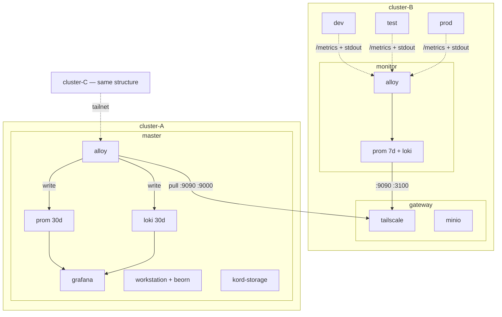
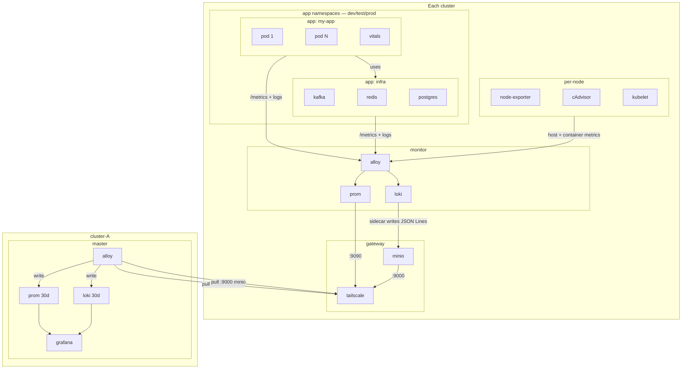

# Infrastructure

Cluster architecture, namespace layout, and deployment operations.

## Namespace Layout

Each k3s cluster is standalone with its own control plane, worker nodes, and observability stack. Clusters connect over Tailscale but operate independently.

| Namespace | Scope | What runs there |
|-----------|-------|----------------|
| `gateway` | Per cluster | Tailscale pod (cluster's external interface), ingress, MinIO |
| `monitor` | Per cluster | Alloy, Prometheus (7d), Loki, KSM, node-exporter |
| `master` | One globally | Prometheus (30d), Loki (30d), Grafana, Alloy (federation), workstation (with Beorn), kord-storage |
| `dev/test/prod` | Per cluster | App workloads only — no infra components |



The `gateway` namespace is the cluster's front door — Tailscale, ingress, and MinIO for log federation. The `master` namespace runs on one cluster and aggregates from all others. The workstation (with Beorn running inside as a background process) is the centralized development and agent execution environment.

## Data Flow

All observability is **pull-based**. Apps follow the [observability contract](monitoring.md).



**Collection:** Alloy scrapes app pods and infra services (via `prometheus.io/scrape` annotations), node-exporter, cAdvisor, kubelet, and KSM. Tails pod stdout via K8s API. Writes to local Prom + Loki.

**Federation:** Gateway Tailscale forwards `:9090` (Prom /federate), `:9000` (MinIO), and `:3100` (Beorn) on the tailnet. Master Alloy pulls metrics via Prom `/federate`. For logs, a puller sidecar on master fetches JSON Lines from each gateway's MinIO via `:9000`, writes to local volume, and master Alloy tails with `loki.source.file`.

!!! note "Loki federation sidecar"
    Loki does not support pull-based federation natively. A sidecar in the monitor Loki pod queries `localhost:3100` every 60s and writes JSON Lines to MinIO in the gateway namespace (1 hour retention, auto-cleaned). Master's puller fetches via Tailscale `:9000`. Labels preserved in JSON Lines, re-extracted by master Alloy's `loki.process` pipeline.

??? abstract "What Alloy normalizes"

    | Source | Raw metric | Normalized to |
    |--------|-----------|---------------|
    | Kubelet | `kubelet_volume_stats_used_bytes` | `pipeline_pvc_used_bytes` |
    | Kubelet | `kubelet_volume_stats_capacity_bytes` | `pipeline_pvc_capacity_bytes` |
    | KSM | `kube_pod_container_status_restarts_total` | `pipeline_container_restarts_total` |
    | KSM | `kube_cronjob_spec_suspend` | `pipeline_cronjob_suspended` |
    | KSM | `kube_cronjob_next_schedule_time` | `pipeline_cronjob_next_schedule_time` |
    | KSM | `kube_pod_container_resource_limits` | `pipeline_container_resource_limits` |
    | Kafka JMX | `kafka_log_log_size` | `pipeline_kafka_topic_size_bytes` |

    All other `kube_*` and `kafka_*` metrics are dropped. App and `node_*` metrics pass through unchanged.

## Manifests

Base manifests at `agents/deployer/skills/infra/manifests/`. Kustomize overlays at `profile/overlays/<cluster>/`.

Shared bases are used by both monitor and master namespaces — overlays customize per namespace:

| Manifest | Used by | What overlays change |
|----------|---------|---------------------|
| `prometheus.yaml` | monitor, master | Port (9090 vs 9191), retention (7d vs 30d), storage (emptyDir vs PVC), resources |
| `loki.yaml` | monitor, master | PVC name, monitor adds federation sidecar |
| `monitor-alloy.yaml` | monitor only | Cluster name env var |
| `master-alloy.yaml` | master only | ConfigMap generated per-cluster |

Namespace-specific manifests use the `<namespace>-` prefix convention.

??? abstract "Full manifest list"

    **Gateway** (per cluster):
    `gateway-pod.yaml`, `gateway-minio.yaml`, `gateway-ingress.yaml`

    **Master** (one globally):
    `master-workstation.yaml`, `master-kord-storage.yaml`, `master-grafana.yaml`, `master-alloy.yaml`, `master-datasources.yaml`, `prometheus.yaml` (base), `loki.yaml` (base)

    **Monitor** (per cluster):
    `monitor-alloy.yaml`, `monitor-alloy-config.yaml`, `monitor-kube-state-metrics.yaml`, `monitor-node-exporter.yaml`, `prometheus.yaml` (base), `loki.yaml` (base)

    **Shared**:
    `namespaces.yaml`, `agent-rbac.yaml`, `agent-scaler-rbac.yaml`

## Key Principles

!!! info "Collection"
    - App namespaces run workloads only — no observability components
    - `monitor` namespace collects all signals (metrics, logs, cluster state)
    - `gateway` namespace exposes the cluster on the tailnet (Tailscale, ingress, MinIO)
    - Apps follow the [observability contract](monitoring.md) — JSON stdout, `/metrics` endpoint, vitals health pod

!!! info "Federation"
    - Master pulls from each cluster's gateway — clusters are unaware of master
    - All clusters are treated identically by master (symmetric design)
    - Grafana queries only master's local stores — single datasource per signal

!!! info "Resilience"
    - If master goes down, clusters keep collecting locally
    - If a cluster goes down, master retains historical data (30d)

---

## Deployer Agent

The deployer agent owns all infrastructure operations — the only agent authorized to write to clusters.

| | |
|---|---|
| **Authority** | kubectl writes, container registry, Redis |
| **Exclusive Tools** | postgres.py, Redis MCP |

### Skills

All operations go through the single `/infra` skill with subcommands:

| Subcommand | Description |
|------------|-------------|
| `/infra bootstrap` | Bootstrap cluster infrastructure (k3s, namespaces, storage) |
| `/infra deploy` | Deploy manifests to a cluster |
| `/infra roll` | Roll between environments (forward or backward) |
| `/infra stop` | Scale down an environment |
| `/infra clean` | Clean up environment data |
| `/infra diff` | Stage incremental data changes |
| `/infra migrate` | Prepare workstation migration handover |
| `/infra generate-overlays` | Generate kustomize overlays from config.yaml |

### Memory

| File | Content |
|------|---------|
| `infra.md` | Infrastructure reference — cluster topology, service endpoints, networking |
| `migration.md` | Full migration lifecycle for deployments |
| `troubleshooting.md` | Common deployment issues and fixes |
| `tools.md` | postgres.py and local utility reference |
| `scratchpad.md` | Working notes and observations |

??? abstract "config.yaml reference"

    ```yaml
    clusters:
      mycluster:
        name: mycluster
        tailscale_ip: 100.x.x.x
        gateway_tailscale_ip: 100.x.x.x
        lan_network: 10.0.0.0/24
        gateway_lan_ip: 10.0.0.1
        nodes: [10.0.0.1, 10.0.0.2]
        namespaces: [gateway, dev, test, prod, monitor]
        manifests: agents/deployer/skills/infra/manifests/
        topology: agents/deployer/skills/infra/topology.yaml
        overlays: profile/overlays/<cluster>/
        services:
          postgres: { port: 30632, user: myuser, database: mydb }
          redis: { port: 30379 }
          registry: { port: 5000, host: 10.0.0.1 }

    network:
      tailnet: tailXXXXXX.ts.net
      grafana_public: grafana.example.com
    ```
