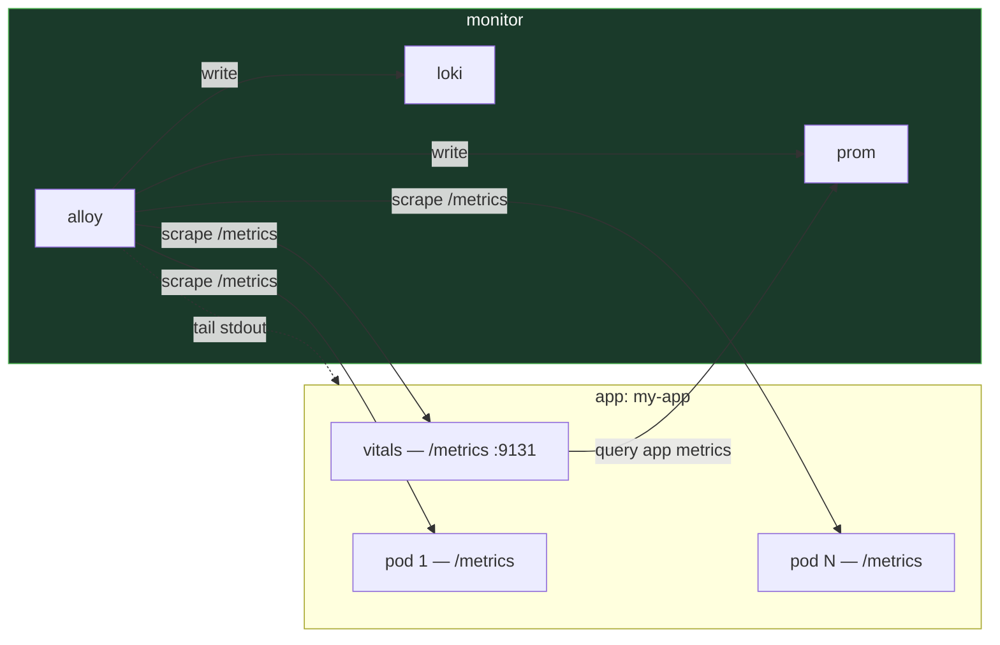

# Monitoring

Observability contract, health evaluation, and the Sauron agent.

## Observability Contract

How apps expose telemetry to the platform. Three concerns — logs, metrics, health — with clear ownership boundaries. All pods belonging to an app share the `app` label — this is how Alloy, Vitals, and Grafana identify which metrics and logs belong together.



| Concern | Owner | Interface | Consumer |
|---------|-------|-----------|----------|
| **Logs** | App pods | Structured JSON to stdout | Alloy (tails via K8s API) |
| **Metrics** | App pods | `/metrics` on app port | Alloy (scrapes) |
| **Health** | Vitals pod | `/metrics` on `:9131` | Alloy (scrapes) |

### Logs

Apps write structured JSON to stdout. No special libraries required — any logger that outputs JSON works.

Alloy tails pod stdout via the K8s API and writes to Loki. Log delivery is **best-effort** — apps must not block on stdout.

Required fields:

| Field | Purpose |
|-------|---------|
| `level` | Log level (info, warning, error) |
| `event` | What happened |

Additional fields are app-defined and become Loki labels automatically via the Alloy processing pipeline.

### Metrics

Apps expose `/metrics` in Prometheus format on their process port. Alloy discovers and scrapes via pod annotations.

Required pod annotations:

```yaml
annotations:
  prometheus.io/scrape: "true"
  prometheus.io/port: "<app-metrics-port>"
```

Alloy normalizes metrics — drops raw `kube_*`/`kafka_*` prefixes, keeps app-specific metrics. Apps should use descriptive metric names with an app-specific prefix.

### Health (Vitals)

Each app deploys **one vitals pod per namespace** that evaluates the app's health and produces standardized health gauges.

**How it works:**

1. Vitals queries Prom for app metrics (cross-namespace: `prometheus.monitor.svc.cluster.local:9090`)
2. Evaluates thresholds and health logic (app-specific domain knowledge)
3. Exposes `vitals_*` gauges on `:9131/metrics`
4. Alloy scrapes vitals like any other pod

**Why standalone, not sidecar:** Health evaluation is often **cross-cutting** — checking Kafka lag across consumer groups, aggregating storage usage across volumes, evaluating pipeline throughput. These require a system-wide view that a per-pod sidecar can't provide.

**Metric convention:** All gauges use **0 = FAIL, 1 = WARNING, 2 = OK**.

| Metric | What it answers |
|--------|----------------|
| `vitals_process{process}` | Is this process alive? |
| `vitals_<section>{check}` | Is this concern healthy? |

**Recommended sections:**

| Section | What it covers |
|---------|---------------|
| `vitals_deps` | External dependencies (databases, APIs, caches) |
| `vitals_ingestion` | Data intake pipelines (Kafka lag, consumption rates) |
| `vitals_storage` | Persistence layer (PVC usage, DB file sizes) |
| `vitals_serving` | Request handling, API readiness |
| `vitals_queue` | Message queue consumers/producers |

Check labels should be short, specific, snake_case: `vitals_deps{check="postgres_primary"}`.

??? abstract "Vitals deployment example"

    ```yaml
    apiVersion: apps/v1
    kind: Deployment
    metadata:
      name: vitals
      labels:
        app: my-app
        component: vitals
    spec:
      replicas: 1
      template:
        metadata:
          labels:
            app: my-app
            component: vitals
          annotations:
            prometheus.io/scrape: "true"
            prometheus.io/port: "9131"
        spec:
          containers:
            - name: vitals
              args: ["-m", "monitor.vitals", "--port", "9131"]
              env:
                - name: PROMETHEUS_URL
                  value: "http://prometheus.monitor.svc.cluster.local:9090"
              ports:
                - containerPort: 9131
                  name: metrics
    ```

??? abstract "Meta-alerting"

    Detect silent vitals failures:

    ```yaml
    - alert: VitalsMissing
      expr: absent(vitals_process{app="my-app"})
      for: 5m
      labels:
        severity: warning
    ```

### When to Use

- Every app deployed to the cluster
- Any service that needs health visibility in Grafana
- Apps with multiple processes that need cross-component health evaluation

### When Not to Use

- Short-lived jobs or CronJobs — use exit codes and job status metrics instead
- Platform infrastructure (Alloy, Prom, Loki) — these have their own health mechanisms

### Related Patterns

- [Service Manager](../reference/patterns/service-manager.md) — managed processes should comply with this contract

---

## Sauron Agent

Owns monitoring, observability, and code validation — the only agent authorized to use Grafana.

Authority: Grafana, code fixes, standards testing. Exclusive tools: nokrashi-tools, klog, Grafana MCP.

=== "Skills"

    | Skill | Description |
    |-------|-------------|
    | `/scan` | Scan a project for monitoring gaps |
    | `/diagnose` | Diagnose a specific issue |

=== "Memory"

    | File | Content |
    |------|---------|
    | `monitoring.md` | Four-layer monitoring model — physical, application, business, alerting |
    | `logging.md` | Structured logging standards across all projects |
    | `grafana_renderer.md` | Prioritize visual dashboard auditing over JSON-only |
    | `tools.md` | nokrashi-tools, klog, Grafana MCP reference |
    | `workflow.md` | Understand, implement, validate, report |
    | `scratchpad.md` | Working notes and observations |
