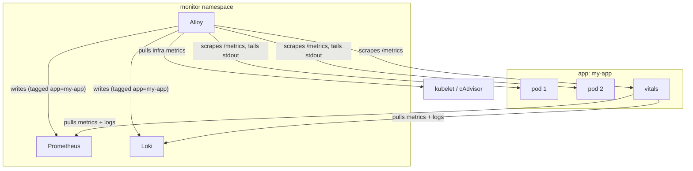

# Monitoring

Observability architecture for apps deployed to the cluster.

## Two-Layer Model

| Layer | Scope | Collector | What |
|-------|-------|-----------|------|
| **Pod** | per-pod | Alloy | Infra metrics, app metrics, logs |
| **App** | per-app | Vitals | Health evaluation, derived metrics |

Alloy collects everything at the pod level and tags it with the `app` label. Vitals queries Prometheus and Loki to produce app-level health evaluations and derived metrics. Alloy also scrapes vitals.



## Alloy: Pod-Level Collection

Alloy is the universal collector. It handles three concerns per pod:

| Concern | Source | How |
|---------|--------|-----|
| Infra metrics | kubelet, cAdvisor | CPU, memory, network, disk — automatic for all pods |
| App metrics | pod `/metrics` | Scraped if pod has `prometheus.io/scrape: "true"` annotation |
| Logs | pod stdout | Tailed via K8s API, written to Loki |

### The `app` Label

Alloy uses relabeling to copy the Kubernetes `app` pod label to a Prometheus/Loki label on everything it collects. This makes all data queryable by application across metrics, logs, and health.

**Requirement**: all pods must have the `app` Kubernetes label.

For pods that expose `/metrics`, add annotations:

```yaml
metadata:
  labels:
    app: my-app
  annotations:
    prometheus.io/scrape: "true"
    prometheus.io/port: "<port>"
```

### Logs

Apps write structured JSON to stdout. No special libraries required.

Alloy tails pod stdout via the K8s API and writes to Loki. Log delivery is **best-effort** — apps must not block on stdout.

Required fields:

| Field | Purpose |
|-------|---------|
| `level` | Log level (info, warning, error) |
| `event` | What happened |

Additional fields are app-defined and become Loki labels automatically via the Alloy processing pipeline.

### Metrics

Apps that have per-pod business metrics expose `/metrics` in Prometheus format. Not every pod needs this — infra metrics (CPU, memory, pod state) are collected automatically via kubelet/cAdvisor.

Alloy discovers scrape targets via pod annotations and adds the `app` label during scrape.

## Vitals: App-Level Evaluation

Each app deploys **one vitals pod per namespace** that evaluates the app's health by querying Prometheus and Loki.

Vitals produces two types of metrics:

1. **Health gauges** — tri-state (`0=FAIL, 1=WARNING, 2=OK`) evaluations of app concerns
2. **Derived metrics** — app-level aggregations that don't exist at the pod level (e.g., end-to-end pipeline latency, cross-pod consumer lag)

### How It Works

1. Vitals queries Prometheus for pod-level metrics (infra + app) and Loki for log patterns
2. Evaluates thresholds and health logic (app-specific domain knowledge)
3. Exposes results on `:9131/metrics`
4. Alloy scrapes vitals like any other pod

Vitals is standalone (not a sidecar) because health evaluation is cross-cutting — checking Kafka lag across consumer groups, aggregating storage across volumes, correlating logs with metrics. These require the system-wide view that Prometheus and Loki provide.

### Health Gauges

| Metric | What it answers |
|--------|----------------|
| `vitals_process{process}` | Is this process alive? |
| `vitals_<section>{check}` | Is this concern healthy? |

**Recommended sections** — extend with app-specific sections as needed:

| Section | What it covers |
|---------|---------------|
| `vitals_deps` | External dependencies (databases, APIs, caches) |
| `vitals_ingestion` | Data intake pipelines (Kafka lag, consumption rates) |
| `vitals_storage` | Persistence layer (PVC usage, DB file sizes) |
| `vitals_serving` | Request handling, API readiness |
| `vitals_queue` | Message queue consumers/producers |

Check labels should be short, specific, snake_case: `vitals_deps{check="postgres_primary"}`.

### Deployment

```yaml
apiVersion: apps/v1
kind: Deployment
metadata:
  name: vitals
  labels:
    app: my-app
    component: vitals
spec:
  replicas: 1
  template:
    metadata:
      labels:
        app: my-app
        component: vitals
      annotations:
        prometheus.io/scrape: "true"
        prometheus.io/port: "9131"
    spec:
      containers:
        - name: vitals
          args: ["-m", "monitor.vitals", "--port", "9131"]
          env:
            - name: PROMETHEUS_URL
              value: "http://prometheus.monitor.svc.cluster.local:9090"
          ports:
            - containerPort: 9131
              name: metrics
```

### Meta-Alerting

Detect silent vitals failures:

```yaml
- alert: VitalsMissing
  expr: absent(vitals_process{app="my-app"})
  for: 5m
  labels:
    severity: warning
```

## When to Use Vitals

- Every app deployed to the cluster that needs health visibility
- Apps with multiple processes that need cross-component health evaluation

## When Not to Use Vitals

- Short-lived jobs or CronJobs — use exit codes and job status metrics
- Platform infrastructure (Alloy, Prometheus, Loki) — these have their own health mechanisms

## Related

- [Service Manager](../reference/patterns/service-manager.md) — managed processes should comply with this contract
- [Sauron agent](../../kordinate/agents/sauron/README.md) — owns monitoring, observability, and Grafana
