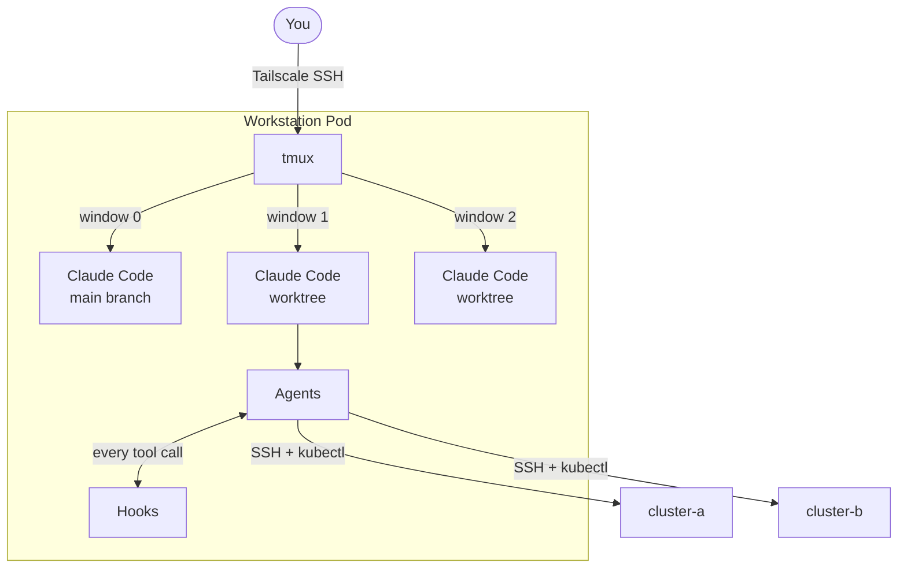
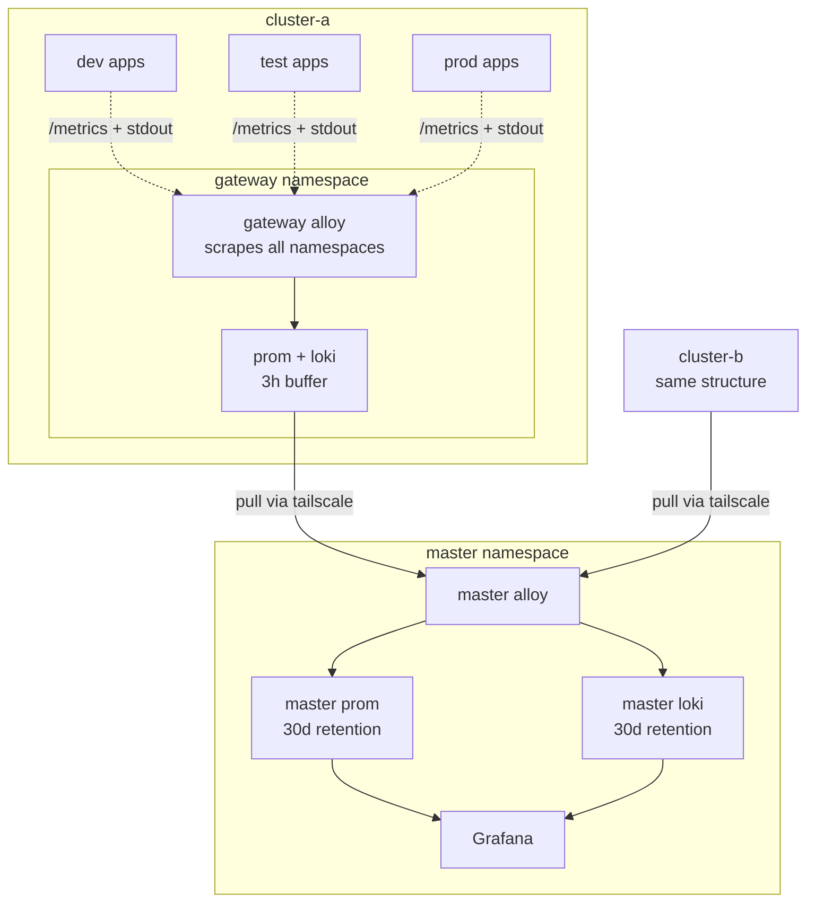
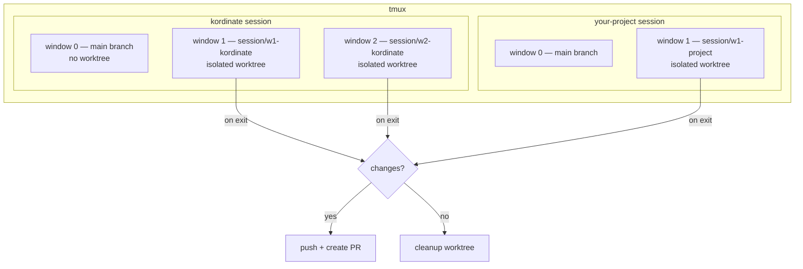

# Infrastructure

How the system is deployed, accessed, and observed.

## Client → Workstation

You connect to a workstation pod running inside Kubernetes via Tailscale SSH. Claude Code runs inside tmux with agents as subprocesses.



## Cluster Architecture

Each k3s cluster is standalone with its own control plane, worker nodes, and observability stack. Clusters connect over Tailscale but operate independently.

App namespaces (`dev`, `test`, `prod`) run workloads only. The `gateway` namespace (called `monitor` in k8s) runs a single Alloy instance that scrapes all namespaces, with local Prom + Loki buffers. The `master` namespace lives on one cluster and pulls from all gateways.



!!! note "Namespace model"
    App namespaces run workloads only — no observability components. Apps emit structured JSON to stdout and expose `/metrics`. The gateway namespace runs a single Alloy that scrapes all app pods (via annotations), kubelet (cAdvisor), KSM, and tails logs via K8s API. It writes to namespace-local Prom + Loki with 3h retention. Master pulls from each cluster's gateway.

## Worktree Sessions

Each tmux window creates an isolated git worktree + branch. On exit: push + PR if changes, cleanup if not.



Branch flow: `session/*` → `main` → `test` → `prod`

## Data Flow

All observability is **pull-based**. The gateway namespace is each cluster's single collection point.

??? abstract "Inside the gateway namespace"

    ```mermaid
    flowchart TB
        subgraph sources[Data Sources]
            AP[App pods<br/>stdout JSON + /metrics]
            KU[Kubelet<br/>/metrics/cadvisor]
            KSM[KSM<br/>:8080/metrics]
        end

        sources -->|pull| GA

        subgraph GA[Gateway Alloy]
            SM[scrape metrics]
            TL[tail logs via K8s API]
            NM[normalize — drop raw kube_*/kafka_*<br/>keep pipeline_* + app metrics]
        end

        GA --> GP[Gateway Prom<br/>3h buffer]
        GA --> GL[Gateway Loki<br/>3h buffer]
    ```

??? abstract "Master federation"

    ```mermaid
    flowchart TB
        MA[Master Alloy] -->|pull /federate| GP[Gateway Prom]
        MA -.->|tail via K8s API| GL[Gateway Loki]

        MA --> MP[Master Prom<br/>30d retention]
        MA --> ML[Master Loki<br/>30d retention]

        MP --> G[Grafana]
        ML --> G
    ```

## Key Principles

!!! info ""
    - App namespaces run workloads only — no observability components
    - One gateway namespace per cluster collects all signals (metrics, logs, cluster state)
    - Master pulls from each cluster's gateway — clusters are unaware of master
    - Both clusters are treated identically by master (symmetric design)
    - Apps write structured JSON to stdout — gateway tails via K8s API
    - Apps expose `/metrics` — gateway discovers and scrapes via pod annotations
    - If master goes down, clusters keep collecting locally (3h buffer)
    - If a cluster goes down, master retains historical data (30d)
    - Grafana queries only master's local stores — single datasource per signal

## Log Shipping

!!! warning "Loki limitation"
    Prometheus has `/federate` for pulling metrics. Loki has no equivalent.

    Workaround: Master Alloy tails pod logs on each cluster via the K8s API, exposed through Gateway Tailscale. Each cluster's Gateway Alloy independently tails the same pods — the two collectors are unaware of each other.

    Logs are tailed twice (once locally, once by master). Acceptable: clusters remain self-contained, master is independently resilient, K8s API log endpoint is lightweight.
