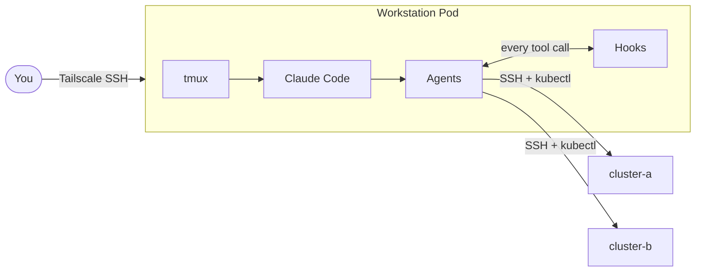
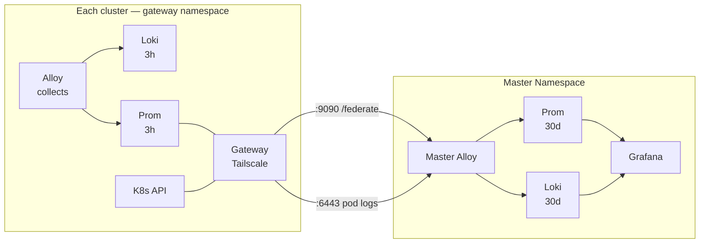

# Infrastructure

How the system is deployed, accessed, and observed.

## Overview



??? abstract "Worktree sessions"

    Each tmux window runs its own Claude Code instance with isolated agents and hooks. Windows create isolated git worktrees + branches via `bin/claude-session`. On exit: push + PR if changes, cleanup if not. The `auto-merge-to-dev.sh` hook then tries to fast-forward main — if it fails, run `/merge`.

    ```mermaid
    flowchart TB
        subgraph tmux
            direction TB
            subgraph ks[kordinate session]
                W0[window 0 — main branch<br/>no worktree]
                W1[window 1 — session/w1-kordinate<br/>isolated worktree]
                W2[window 2 — session/w2-kordinate<br/>isolated worktree]
            end
            subgraph ps[your-project session]
                PW0[window 0 — main branch]
                PW1[window 1 — session/w1-project<br/>isolated worktree]
            end
        end

        W1 & W2 & PW1 -->|on exit| PR{changes?}
        PR -->|yes| PUSH[push + create PR]
        PR -->|no| CLEAN[cleanup worktree]
        PUSH --> FF{fast-forward main?}
        FF -->|yes| CLOSE[close PR]
        FF -->|no| MERGE[run /merge]
    ```

    Branch flow: `session/*` → `main` → `test` → `prod`

??? abstract "Cluster architecture"

    Each k3s cluster is standalone with its own control plane, worker nodes, and observability stack. Clusters connect over Tailscale but operate independently.

    App namespaces (`dev`, `test`, `prod`) run workloads only. The `gateway` namespace (called `monitor` in k8s) runs a single Alloy instance that scrapes all namespaces, with local Prom + Loki buffers. The `master` namespace pulls from all gateways. In practice, master runs on one of the clusters but is logically independent.

    ```mermaid
    flowchart TB
        subgraph CA[cluster-a]
            A1[dev apps] & A2[test apps] & A3[prod apps]

            subgraph gw-a[gateway namespace]
                GA[gateway alloy<br/>scrapes all namespaces] --> PA[prom + loki<br/>3h buffer]
            end

            A1 & A2 & A3 -.->|/metrics + stdout| GA
        end

        subgraph M[master namespace]
            MA[master alloy] --> MP[master prom<br/>30d retention]
            MA --> ML[master loki<br/>30d retention]
            MP --> G[Grafana]
            ML --> G
        end

        PA -->|pull via tailscale| MA

        CB[cluster-b<br/>same structure]

        CB -->|pull via tailscale| MA
    ```

    !!! note "Namespace model"
        App namespaces run workloads only — no observability components. Apps emit structured JSON to stdout and expose `/metrics`. The gateway namespace runs a single Alloy that scrapes all app pods (via annotations), kubelet (cAdvisor), KSM, and tails logs via K8s API. It writes to namespace-local Prom + Loki with 3h retention. Master pulls from each cluster's gateway.

## Data Flow

All observability is **pull-based**. Apps follow the [observability contract](reference/patterns/observability-contract.md) — Gateway Alloy collects everything into local Prom + Loki. Gateway Tailscale federates to master.



Gateway Tailscale exposes `:9090` (Prom), `:3100` (Loki), `:6443` (K8s API) on the tailnet. Master pulls metrics via `/federate` from `:9090` and tails pod logs via K8s API from `:6443`. Master never reads from Gateway Loki — `:3100` is for direct cluster debugging only.

!!! warning "Why logs are tailed twice"
    Loki has no `/federate` equivalent. Master tails the same pods independently via K8s API. Each cluster's Gateway Alloy also tails locally. The two collectors are unaware of each other. Acceptable: clusters remain self-contained, master is independently resilient, K8s API log endpoint is lightweight.

## Key Principles

!!! info "Collection"
    - App namespaces run workloads only — no observability components
    - One gateway namespace per cluster collects all signals (metrics, logs, cluster state)
    - Apps follow the [observability contract](reference/patterns/observability-contract.md) — JSON stdout, `/metrics` endpoint, vitals health pod

!!! info "Federation"
    - Master pulls from each cluster's gateway — clusters are unaware of master
    - Both clusters are treated identically by master (symmetric design)
    - Grafana queries only master's local stores — single datasource per signal

!!! info "Resilience"
    - If master goes down, clusters keep collecting locally (3h buffer)
    - If a cluster goes down, master retains historical data (30d)
