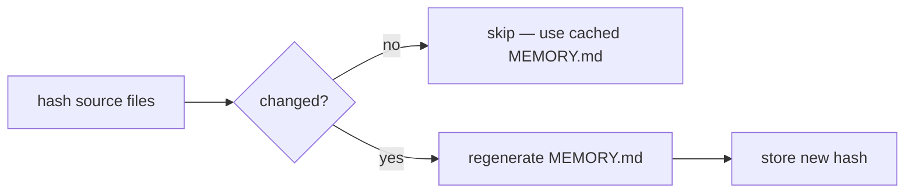

# Memory System

How agents store and discover knowledge.

## Per-Agent Structure

```
agents/<agent>/
├── AGENT.md              # role, commands, rules
├── instructions/         # procedures (workflow, auth, tools)
├── memory/
│   ├── static/           # curated knowledge (generic)
│   └── dynamic/          # auto-managed notes (site-specific, encrypted)
└── commands/             # slash command definitions
```

## Three Layers

=== "Static"

    `agents/<agent>/memory/static/`

    Curated knowledge that applies to any installation — architecture, libraries, troubleshooting. Not encrypted.

=== "Dynamic"

    `agents/<agent>/memory/dynamic/`

    Auto-managed notes accumulated during use — cluster IPs, debug findings, operational tips. **Git-crypt encrypted.**

=== "Project"

    `<repo>/.claude/agent-memory/<agent>/`

    Knowledge tied to a specific project — metrics catalogs, health checks. Not encrypted.

## How Agents Get Context on Startup

The `agent-memory.sh` hook fires before every agent spawn using `lib/cache.sh` for hash-based invalidation:



??? info "What gets hashed"
    `instructions/` + `memory/static/` + `shared/MEMORY.md`

??? info "What the generated MEMORY.md contains"
    - **Shared rules** from `shared/MEMORY.md`
    - **Instructions** from `instructions/*.md` (always inlined)
    - **Static knowledge** — inlined if small (<500 lines), indexed if large
    - **Notes** — preserved from previous `MEMORY.md` (Claude's auto-managed section)

    Claude auto-loads `MEMORY.md` on startup. The agent gets full context without needing to read files itself.

## Shared Memory

Injected into every agent's generated `MEMORY.md` by the hook. Contains operational rules all agents share (credentials, commit conventions, tool restrictions).

```
agents/shared/
├── MEMORY.md                    # common rules for all agents
└── memory/dynamic/              # consultation cache files
```

## Consultation Cache

!!! tip "Cache mechanics"
    Consultation results are cached at `agents/shared/memory/dynamic/<consulter>-<consultant>.cache`.

    The cache uses the same `lib/cache.sh` hash system as agent memory — if the consultant's source files change, the cache goes stale automatically. Agents can also force re-consultation via `/invalidate <agent>`.
