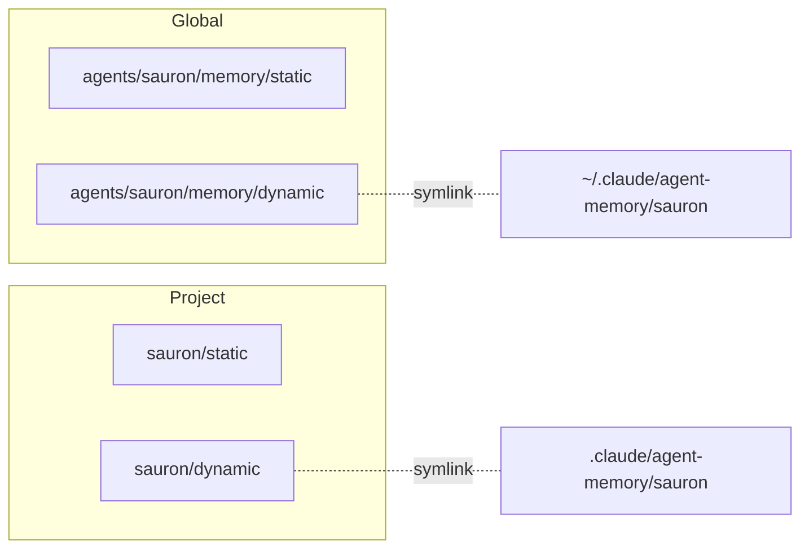

# Linking

Kordinate's framework lives in `~/kordinate/kordinate/`. Claude Code expects its files at `~/.claude/`. The linking layer (`installer/link-claude.sh`) bridges them.

## Direct (same structure)

| Claude Code | Kordinate |
|-------------|-----------|
| `agents/` | `agents/` |
| `commands/` | `commands/` |

## Remapped (different location)

| Claude Code | Kordinate | Why different |
|-------------|-----------|---------------|
| `settings.json` | `settings.json` (framework root) | Framework config, not inside agents/ |
| `keybindings.json` | `profile/keybindings.json` | Site-specific |
| `.mcp.json` | `profile/mcp.json` | Site-specific, encrypted |
| `agent-memory/<agent>/` | `agents/<agent>/memory/dynamic/` | Memory colocated with agent, not separate tree |

## Renamed (different filename)

Kordinate uses `KORD.md`, Claude Code expects `CLAUDE.md`. Copied on `link-claude.sh deploy`, synced back on `link-claude.sh sync`:

| Claude Code | Kordinate |
|-------------|-----------|
| `CLAUDE.md` | `agents/KORD.md` |
| `agents/<agent>/CLAUDE.md` | `agents/<agent>/KORD.md` |

## Kordinate-specific links

Not Claude Code conventions — linked so hooks and scripts resolve at stable paths:

| At `~/.claude/` | Kordinate | Used by |
|------------------|-----------|---------|
| `hooks/` | `hooks/` | `settings.json` references `$HOME/.claude/hooks/` |
| `profile/` | `profile/` | Hooks read locks at `profile/locks/` |

## External

| Link | Target | Purpose |
|------|--------|---------|
| `profile/keystore/` | `~/.password-store/kordinate/` | GPG credential store (`pass`) |

## Memory Mapping

The linking layer maps kordinate's [2D memory](../framework/memory.md) into the runtime's expected paths:



??? abstract "How memory is assembled at spawn"

    `agent-memory.sh` assembles a single `MEMORY.md` in the agent's dynamic dir from:

    | Source | How it's included |
    |--------|------------------|
    | `shared/MEMORY.md` | Always inlined — team rules for all agents |
    | `instructions/*.md` | Always inlined — agent-specific procedures |
    | `memory/static/*.md` | Inlined if ≤500 lines, indexed if larger |
    | Previous `## Notes` | Preserved — Claude's auto-managed section |

    ```mermaid
    flowchart TD
        SP[agent spawn] --> HC{sources changed?}
        HC -->|no| SK[skip — cached MEMORY.md is fresh]
        HC -->|yes| GEN[regenerate MEMORY.md]
        GEN --> ST[store new hash]
        ST --> SK
    ```
