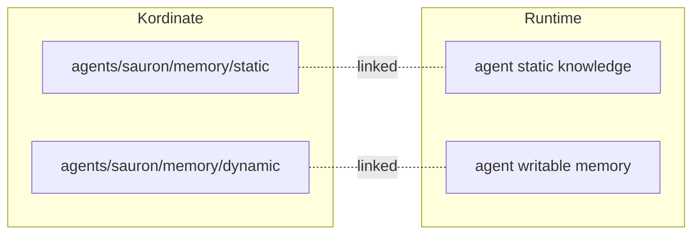

# Linking

The linking layer maps kordinate's file structure to what the agent runtime expects. Kordinate is runtime-agnostic — the linking layer is the only part that changes when switching runtimes.

## What Gets Linked

| Kordinate | Purpose |
|-----------|---------|
| `KORD.md` | Agent identity — mapped to runtime's agent config |
| `memory/static/` | Curated knowledge — made accessible to the agent |
| `memory/dynamic/` | Auto-managed state — writable by the agent |
| `commands/` | Slash command definitions |
| `hooks/` | Guard and automation scripts |

The linking layer creates symlinks, copies, and renames as needed to make these available at the paths the runtime expects.

## Memory Mapping

The linking layer maps kordinate's [2D memory](../framework/memory.md) into the runtime:

??? abstract "How memory is assembled at spawn"

    A hook assembles a single file from static memory that the runtime auto-loads:

    | Source | How it's included |
    |--------|------------------|
    | Root's `static/team/` | Always inlined — team rules for all agents |
    | `memory/static/instructions/` | Always inlined — agent procedures |
    | `memory/static/*.md` | Inlined if small, indexed if large |
    | Previous agent notes | Preserved across spawns |

---

## Claude Code

The current linking implementation targets Claude Code. Run `installer/link-claude.sh` to apply.

### Identity

| Claude Code | Kordinate |
|-------------|-----------|
| `CLAUDE.md` | `agents/root/KORD.md` |
| `agents/<agent>/CLAUDE.md` | `agents/<agent>/KORD.md` |

### Symlinks

| At `~/.claude/` | Kordinate |
|------------------|-----------|
| `agents/` | `agents/` |
| `commands/` | `commands/` |
| `hooks/` | `hooks/` |
| `agent-memory/<agent>/` | `agents/<agent>/memory/dynamic/` |
| `settings.json` | `settings.json` |
| `keybindings.json` | `profile/keybindings.json` |
| `.mcp.json` | `profile/mcp.json` |
| `profile/` | `profile/` |

### External

| Link | Target | Purpose |
|------|--------|---------|
| `profile/keystore/` | `~/.password-store/kordinate/` | GPG credential store (`pass`) |
